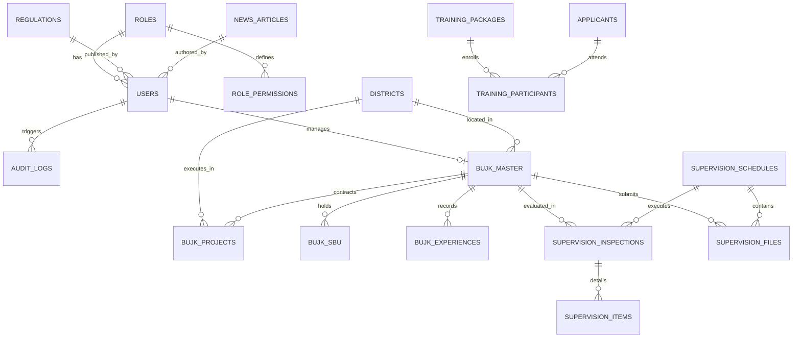

# Spesifikasi Skema Basis Data — SIJAKON BOGOR

> **Dokumentasi Skema Relasional, Spasial (PostGIS) & Data Dictionary**
> Versi: 1.0.0 | Tanggal: Agustus 2026

---

## 1. Ikhtisar Basis Data

SIJAKON BOGOR menggunakan **PostgreSQL 16** dengan ekstensi spasial **PostGIS 3.4**. Seluruh koordinat dan poligon geospasial disimpan menggunakan sistem referensi koordinat standar **EPSG:4326 (WGS 84)**.

### 1.1 Diagram Relasi Entitas (ERD Blueprint)



---

## 2. Definisi Skema Tabel (Data Dictionary)

### 2.1 Modul Manajemen Pengguna & Keamanan (RBAC)

#### Tabel: `roles`
Menyimpan tingkatan peran utama dalam sistem (5 role login + Publik tanpa login).

| Kolom | Tipe Data | Constraint | Deskripsi |
| :--- | :--- | :--- | :--- |
| `id` | `VARCHAR(36)` | `PRIMARY KEY` | UUID v4 / CUID |
| `code` | `VARCHAR(30)` | `NOT NULL, UNIQUE` | Kode peran teknis (`SUPER_ADMIN`, `ADMIN_BIDANG`, `EKSEKUTIF`, `OPERATOR_BUJK`, `PESERTA_TKK`) |
| `name` | `VARCHAR(100)` | `NOT NULL` | Nama peran tampilan |
| `description` | `VARCHAR(255)` | `NULLABLE` | Deskripsi wewenang peran |
| `is_system` | `BOOLEAN` | `DEFAULT FALSE` | `TRUE` = role bawaan sistem (tidak bisa dihapus) |
| `created_at` | `TIMESTAMPTZ` | `DEFAULT NOW()` | Waktu pembuatan |
| `updated_at` | `TIMESTAMPTZ` | `DEFAULT NOW()` | Waktu pembaruan |

**Seed Data Wajib:**

| `code` | `name` | `description` | `is_system` |
| :--- | :--- | :--- | :---: |
| `SUPER_ADMIN` | Super Admin | Full access seluruh sistem. Kelola user, RBAC, audit trail. | `TRUE` |
| `ADMIN_BIDANG` | Admin Bidang | Operator dinas — permission dikonfigurasi per bidang via RBAC (varian: Bina Konstruksi, Pelatihan, Pengawas). | `TRUE` |
| `EKSEKUTIF` | Eksekutif | Read-only dashboard & laporan eksekutif. Kepala Dinas, PPK, Bupati. | `TRUE` |
| `OPERATOR_BUJK` | Operator BUJK | Portal mandiri kontraktor. Tenant-scoped via `bujk_id`. | `TRUE` |
| `PESERTA_TKK` | Peserta TKK | Portal peserta pelatihan & sertifikasi. | `TRUE` |

#### Tabel: `role_permissions`
Matriks hak akses granular per peran per aksi.

| Kolom | Tipe Data | Constraint | Deskripsi |
| :--- | :--- | :--- | :--- |
| `id` | `VARCHAR(36)` | `PRIMARY KEY` | UUID v4 |
| `role_id` | `VARCHAR(36)` | `FK -> roles(id) ON DELETE CASCADE` | ID peran terkait |
| `resource` | `VARCHAR(50)` | `NOT NULL` | Modul/Entity target (`BUJK`, `PROJECT`, `SUPERVISION`, `TRAINING`, `USER`, `REPORT`) |
| `action` | `VARCHAR(30)` | `NOT NULL` | Aksi yang diizinkan (`CREATE`, `READ`, `UPDATE`, `DELETE`, `VERIFY`, `EXPORT`, `AUDIT`) |
| `is_granted` | `BOOLEAN` | `DEFAULT TRUE` | Status aktif hak akses |

#### Tabel: `users`
Akun pengguna internal dinas, asosiasi, pengawas, dan BUJK.

| Kolom | Tipe Data | Constraint | Deskripsi |
| :--- | :--- | :--- | :--- |
| `id` | `VARCHAR(36)` | `PRIMARY KEY` | UUID v4 |
| `role_id` | `VARCHAR(36)` | `FK -> roles(id) ON DELETE RESTRICT` | Peran pengguna |
| `bujk_id` | `VARCHAR(36)` | `FK -> bujk_master(id) ON DELETE SET NULL, NULLABLE` | Referensi BUJK (jika role `OPERATOR_BUJK`) |
| `username` | `VARCHAR(50)` | `NOT NULL, UNIQUE` | Username login |
| `email` | `VARCHAR(100)` | `NOT NULL, UNIQUE` | Alamat email resmi |
| `password_hash` | `VARCHAR(255)` | `NOT NULL` | Hash password (Argon2id / Bcrypt) |
| `full_name` | `VARCHAR(150)` | `NOT NULL` | Nama lengkap |
| `phone_number` | `VARCHAR(20)` | `NULLABLE` | No. WhatsApp/Telepon |
| `is_active` | `BOOLEAN` | `DEFAULT TRUE` | Status akun aktif/dinonaktifkan |
| `last_login_at` | `TIMESTAMPTZ` | `NULLABLE` | Waktu login terakhir |
| `created_at` | `TIMESTAMPTZ` | `DEFAULT NOW()` | Waktu pendaftaran |
| `updated_at` | `TIMESTAMPTZ` | `DEFAULT NOW()` | Waktu modifikasi terakhir |

#### Tabel: `audit_logs`
Pencatatan riwayat setiap aktivitas mutasi data untuk akuntabilitas.

| Kolom | Tipe Data | Constraint | Deskripsi |
| :--- | :--- | :--- | :--- |
| `id` | `BIGSERIAL` | `PRIMARY KEY` | Auto-increment identifier |
| `user_id` | `VARCHAR(36)` | `FK -> users(id) ON DELETE SET NULL, NULLABLE` | Pelaku aksi |
| `action` | `VARCHAR(20)` | `NOT NULL` | Tipe mutasi (`CREATE`, `UPDATE`, `DELETE`, `LOGIN`, `EXPORT`) |
| `module` | `VARCHAR(50)` | `NOT NULL` | Modul yang diproses (`BUJK`, `SUPERVISION`, dll.) |
| `record_id` | `VARCHAR(100)` | `NULLABLE` | ID rekaman data yang dimutasi |
| `old_values` | `JSONB` | `NULLABLE` | Data sebelum perubahan |
| `new_values` | `JSONB` | `NULLABLE` | Data setelah perubahan |
| `ip_address` | `INET` | `NULLABLE` | Alamat IP pengguna |
| `user_agent` | `VARCHAR(255)` | `NULLABLE` | Informasi browser/perangkat |
| `created_at` | `TIMESTAMPTZ` | `DEFAULT NOW()` | Waktu aksi |

---

### 2.2 Modul Master Wilayah & BUJK

#### Tabel: `districts` (40 Kecamatan Kab. Bogor)
Data spasial batas wilayah administrasi 40 Kecamatan di Kabupaten Bogor.

| Kolom | Tipe Data | Constraint | Deskripsi |
| :--- | :--- | :--- | :--- |
| `id` | `INTEGER` | `PRIMARY KEY` | Kode wilayah BPS / Kemendagri |
| `name` | `VARCHAR(100)` | `NOT NULL` | Nama Kecamatan (misal: `Cibinong`, `Babakan Madang`, dll.) |
| `code` | `VARCHAR(10)` | `NOT NULL, UNIQUE` | Kode unik kecamatan |
| `geom_boundary` | `geometry(MultiPolygon, 4326)` | `NOT NULL` | Poligon batas administratif wilayah |
| `centroid` | `geometry(Point, 4326)` | `NULLABLE` | Titik koordinat pusat kecamatan |

#### Tabel: `bujk_master`
Data profil induk Badan Usaha Jasa Konstruksi.

| Kolom | Tipe Data | Constraint | Deskripsi |
| :--- | :--- | :--- | :--- |
| `id` | `VARCHAR(36)` | `PRIMARY KEY` | UUID v4 |
| `name` | `VARCHAR(255)` | `NOT NULL` | Nama resmi BUJK (e.g., `PT Wijaya Karya`) |
| `entity_type` | `VARCHAR(20)` | `NOT NULL` | Bentuk usaha (`PT`, `CV`, `PO`, `KOPERASI`, `PERUMDA`) |
| `nib` | `VARCHAR(13)` | `NOT NULL, UNIQUE` | Nomor Induk Berusaha (13 digit) |
| `npwp` | `VARCHAR(20)` | `NOT NULL, UNIQUE` | NPWP Perusahaan |
| `leader_name` | `VARCHAR(150)` | `NOT NULL` | Nama Direktur / Penanggung Jawab BUJK |
| `pjt_name` | `VARCHAR(150)` | `NOT NULL` | Penanggung Jawab Teknis (PJT) |
| `pjsk_name` | `VARCHAR(150)` | `NULLABLE` | Penanggung Jawab Subklasifikasi (PJSK) |
| `district_id` | `INTEGER` | `FK -> districts(id) ON DELETE RESTRICT` | Kecamatan lokasi kantor |
| `address` | `TEXT` | `NOT NULL` | Alamat lengkap domisili |
| `postal_code` | `VARCHAR(10)` | `NULLABLE` | Kode pos |
| `phone` | `VARCHAR(30)` | `NOT NULL` | Telepon kantor |
| `email` | `VARCHAR(100)` | `NOT NULL` | Email resmi perusahaan |
| `website` | `VARCHAR(150)` | `NULLABLE` | Alamat situs web |
| `geom_location` | `geometry(Point, 4326)` | `NULLABLE` | Titik koordinat spasial kantor (Lat/Long) |
| `legal_doc_url` | `VARCHAR(500)` | `NULLABLE` | URL berkas PDF Akta/NIB di Object Storage |
| `status` | `VARCHAR(30)` | `DEFAULT 'DRAFT'` | `DRAFT`, `PENDING_VERIFICATION`, `APPROVED`, `REJECTED`, `SUSPENDED` |
| `rejection_reason` | `TEXT` | `NULLABLE` | Alasan penolakan jika verifikasi ditolak |
| `verified_by` | `VARCHAR(36)` | `FK -> users(id), NULLABLE` | Admin verifikator |
| `verified_at` | `TIMESTAMPTZ` | `NULLABLE` | Tanggal persetujuan verifikasi |
| `created_at` | `TIMESTAMPTZ` | `DEFAULT NOW()` | Waktu entri |
| `updated_at` | `TIMESTAMPTZ` | `DEFAULT NOW()` | Waktu pembaharuan |

#### Tabel: `bujk_sbu`
Sertifikat Badan Usaha yang dimiliki BUJK.

| Kolom | Tipe Data | Constraint | Deskripsi |
| :--- | :--- | :--- | :--- |
| `id` | `VARCHAR(36)` | `PRIMARY KEY` | UUID v4 |
| `bujk_id` | `VARCHAR(36)` | `FK -> bujk_master(id) ON DELETE CASCADE` | Relasi ke BUJK induk |
| `cert_number` | `VARCHAR(100)` | `NOT NULL` | Nomor Registrasi SBU |
| `issuer` | `VARCHAR(150)` | `NOT NULL` | Lembaga Sertifikasi (LSBU) Penerbit |
| `kbli_code` | `VARCHAR(10)` | `NOT NULL` | Kode KBLI 5 Digit (e.g. `41011`, `42101`) |
| `subclassification` | `VARCHAR(255)` | `NOT NULL` | Nama Subklasifikasi Pekerjaan |
| `qualification` | `VARCHAR(20)` | `NOT NULL` | Kualifikasi (`KECIL`, `MENENGAH`, `BESAR`) |
| `issued_date` | `DATE` | `NOT NULL` | Tanggal terbit SBU |
| `valid_until` | `DATE` | `NOT NULL` | Tanggal berakhir masa berlaku |
| `file_url` | `VARCHAR(500)` | `NOT NULL` | URL dokumen SBU (PDF) di Object Storage |
| `is_active` | `BOOLEAN` | `DEFAULT TRUE` | Status aktif/kedaluwarsa |
| `created_at` | `TIMESTAMPTZ` | `DEFAULT NOW()` | Waktu pembuatan |

#### Tabel: `bujk_experiences`
Pengalaman kerja / portofolio proyek masa lalu.

| Kolom | Tipe Data | Constraint | Deskripsi |
| :--- | :--- | :--- | :--- |
| `id` | `VARCHAR(36)` | `PRIMARY KEY` | UUID v4 |
| `bujk_id` | `VARCHAR(36)` | `FK -> bujk_master(id) ON DELETE CASCADE` | BUJK pelaksana |
| `project_name` | `VARCHAR(255)` | `NOT NULL` | Nama paket pekerjaan konstruksi |
| `owner_name` | `VARCHAR(150)` | `NOT NULL` | Pemilik pekerjaan (Dinas/Swasta/BUMN) |
| `contract_number` | `VARCHAR(100)` | `NOT NULL` | Nomor kontrak pekerjaan |
| `contract_value` | `NUMERIC(18,2)` | `NOT NULL` | Nilai kontrak dalam Rupiah |
| `fiscal_year` | `INTEGER` | `NOT NULL` | Tahun anggaran pelaksanaan |
| `pho_date` | `DATE` | `NULLABLE` | Tanggal Serah Terima Pertama (PHO) |
| `fho_date` | `DATE` | `NULLABLE` | Tanggal Serah Terima Akhir (FHO) |
| `bast_file_url` | `VARCHAR(500)` | `NULLABLE` | Berkas BAST/PHO (PDF) |
| `created_at` | `TIMESTAMPTZ` | `DEFAULT NOW()` | Waktu pencatatan |

---

### 2.3 Modul Monitoring Proyek & Geospasial (WebGIS)

#### Tabel: `bujk_projects`
Paket pekerjaan konstruksi aktif yang sedang berjalan di Kab. Bogor.

| Kolom | Tipe Data | Constraint | Deskripsi |
| :--- | :--- | :--- | :--- |
| `id` | `VARCHAR(36)` | `PRIMARY KEY` | UUID v4 |
| `bujk_id` | `VARCHAR(36)` | `FK -> bujk_master(id) ON DELETE RESTRICT` | BUJK Kontraktor Pelaksana |
| `district_id` | `INTEGER` | `FK -> districts(id) ON DELETE RESTRICT` | Lokasi Kecamatan proyek |
| `project_name` | `VARCHAR(255)` | `NOT NULL` | Nama paket pekerjaan |
| `fiscal_year` | `INTEGER` | `NOT NULL` | Tahun Anggaran (e.g. `2026`) |
| `budget_source` | `VARCHAR(50)` | `NOT NULL` | Sumber Dana (`APBD_KAB`, `APBD_PROV`, `APBN`, `DAK`, `SWASTA`) |
| `contract_number` | `VARCHAR(100)` | `NOT NULL` | Nomor Kontrak Proyek |
| `contract_value` | `NUMERIC(18,2)` | `NOT NULL` | Nilai Kontrak (Rupiah) |
| `start_date` | `DATE` | `NOT NULL` | Tanggal Mulai SPMK |
| `end_date` | `DATE` | `NOT NULL` | Target Selesai Kontrak |
| `physical_progress`| `NUMERIC(5,2)` | `DEFAULT 0.00` | Realisasi Fisik Terakhir (%) |
| `financial_progress`| `NUMERIC(5,2)` | `DEFAULT 0.00` | Realisasi Keuangan Terakhir (%) |
| `planned_progress` | `NUMERIC(5,2)` | `DEFAULT 0.00` | Target Rencana Kurva S (%) |
| `geom_location` | `geometry(Point, 4326)` | `NULLABLE` | Koordinat titik pusat proyek |
| `geom_area` | `geometry(Polygon, 4326)` | `NULLABLE` | Delineasi poligon area pekerjaan |
| `status` | `VARCHAR(30)` | `DEFAULT 'ON_PROGRESS'` | `ON_PROGRESS`, `COMPLETED`, `CRITICAL_DELAY`, `TERMINATED` |
| `created_at` | `TIMESTAMPTZ` | `DEFAULT NOW()` | Waktu input |
| `updated_at` | `TIMESTAMPTZ` | `DEFAULT NOW()` | Waktu update |

#### Tabel: `project_progress_logs`
Riwayat kurva S dan laporan berkala progres proyek.

| Kolom | Tipe Data | Constraint | Deskripsi |
| :--- | :--- | :--- | :--- |
| `id` | `VARCHAR(36)` | `PRIMARY KEY` | UUID v4 |
| `project_id` | `VARCHAR(36)` | `FK -> bujk_projects(id) ON DELETE CASCADE` | Proyek terkait |
| `report_week` | `INTEGER` | `NOT NULL` | Minggu ke- (1..52) |
| `report_date` | `DATE` | `NOT NULL` | Tanggal laporan |
| `plan_pct` | `NUMERIC(5,2)` | `NOT NULL` | Rencana progres kumulatif (%) |
| `actual_pct` | `NUMERIC(5,2)` | `NOT NULL` | Realisasi progres kumulatif (%) |
| `deviation` | `NUMERIC(5,2)` | `GENERATED ALWAYS AS (actual_pct - plan_pct) STORED` | Deviasi (+ / -) |
| `documentation_url`| `VARCHAR(500)` | `NULLABLE` | Foto dokumentasi fisik lapangan |
| `notes` | `TEXT` | `NULLABLE` | Catatan kendala/cuaca |
| `created_at` | `TIMESTAMPTZ` | `DEFAULT NOW()` | Waktu pencatatan |

---

### 2.4 Modul Pengawasan Tertib Konstruksi (Permen PUPR 1/2023)

#### Tabel: `supervision_schedules`
Agenda jadwal pengawasan berkala oleh Dinas PUPR.

| Kolom | Tipe Data | Constraint | Deskripsi |
| :--- | :--- | :--- | :--- |
| `id` | `VARCHAR(36)` | `PRIMARY KEY` | UUID v4 |
| `fiscal_year` | `INTEGER` | `NOT NULL` | Tahun pengawasan |
| `schedule_name` | `VARCHAR(200)` | `NOT NULL` | Nama periode (e.g. `Pengawasan Semester I TA 2026`) |
| `start_date` | `DATE` | `NOT NULL` | Tanggal mulai pengawasan |
| `end_date` | `DATE` | `NOT NULL` | Tanggal batas pengawasan |
| `scope` | `VARCHAR(50)` | `NOT NULL` | Lingkup pengawasan (`TERTIB_USAHA`, `TERTIB_PENYELENGGARAAN`, `TERTIB_PEMANFAATAN`, `GABUNGAN`) |
| `status` | `VARCHAR(30)` | `DEFAULT 'OPEN'` | `DRAFT`, `OPEN`, `IN_INSPECTION`, `COMPLETED`, `CLOSED` |

#### Tabel: `supervision_files`
Unggahan berkas instrumen audit digital / SIMAK per BUJK.

| Kolom | Tipe Data | Constraint | Deskripsi |
| :--- | :--- | :--- | :--- |
| `id` | `VARCHAR(36)` | `PRIMARY KEY` | UUID v4 |
| `schedule_id` | `VARCHAR(36)` | `FK -> supervision_schedules(id) ON DELETE RESTRICT` | Jadwal terkait |
| `bujk_id` | `VARCHAR(36)` | `FK -> bujk_master(id) ON DELETE RESTRICT` | BUJK yang diaudit |
| `file_type` | `VARCHAR(50)` | `NOT NULL` | Tipe instrumen (`SIMAK_EXCEL`, `BUKTI_DUKUNG_PDF`) |
| `file_url` | `VARCHAR(500)` | `NOT NULL` | URL berkas |
| `uploaded_by` | `VARCHAR(36)` | `FK -> users(id)` | User pengunggah |
| `uploaded_at` | `TIMESTAMPTZ` | `DEFAULT NOW()` | Waktu unggah |

#### Tabel: `supervision_inspections`
Hasil rekapitulasi penilaian kepatuhan pengawasan.

| Kolom | Tipe Data | Constraint | Deskripsi |
| :--- | :--- | :--- | :--- |
| `id` | `VARCHAR(36)` | `PRIMARY KEY` | UUID v4 |
| `schedule_id` | `VARCHAR(36)` | `FK -> supervision_schedules(id) ON DELETE RESTRICT` | Jadwal terkait |
| `bujk_id` | `VARCHAR(36)` | `FK -> bujk_master(id) ON DELETE RESTRICT` | BUJK target |
| `project_id` | `VARCHAR(36)` | `FK -> bujk_projects(id), NULLABLE` | Paket proyek yang diinspeksi (jika tertib penyelenggaraan) |
| `inspector_id` | `VARCHAR(36)` | `FK -> users(id) ON DELETE RESTRICT` | Asesor / Petugas Pengawas |
| `business_order_score` | `NUMERIC(5,2)` | `DEFAULT 0.00` | Skor Tertib Usaha (Bobot 40%) |
| `execution_order_score` | `NUMERIC(5,2)` | `DEFAULT 0.00` | Skor Tertib Penyelenggaraan (Bobot 35%) |
| `utilization_order_score` | `NUMERIC(5,2)` | `DEFAULT 0.00` | Skor Tertib Pemanfaatan (Bobot 25%) |
| `final_score` | `NUMERIC(5,2)` | `NOT NULL` | Skor Komposit Akhir (0.00 - 100.00) |
| `compliance_status` | `VARCHAR(30)` | `NOT NULL` | `TERTIB` (≥80), `CUKUP_TERTIB` (60-79.9), `KURANG_TERTIB` (<60) |
| `official_memo` | `TEXT` | `NULLABLE` | Rekomendasi/Teguran Pengawas Dinas |
| `inspected_at` | `TIMESTAMPTZ` | `DEFAULT NOW()` | Waktu pelaksanaan audit |

---

### 2.5 Modul Pelatihan & Sertifikasi TKK

#### Tabel: `training_packages`
Paket program bimbingan teknis & sertifikasi tenaga kerja konstruksi.

| Kolom | Tipe Data | Constraint | Deskripsi |
| :--- | :--- | :--- | :--- |
| `id` | `VARCHAR(36)` | `PRIMARY KEY` | UUID v4 |
| `name` | `VARCHAR(255)` | `NOT NULL` | Nama Pelatihan (e.g. `Bimtek SMKK Petugas Keselamatan Konstruksi`) |
| `fiscal_year` | `INTEGER` | `NOT NULL` | Tahun Anggaran |
| `funding_source` | `VARCHAR(50)` | `NOT NULL` | Sumber Dana (`APBD_KAB`, `APBN`, `CSR`) |
| `kkni_level` | `INTEGER` | `NOT NULL` | Jenjang KKNI (1 s.d. 9) |
| `quota` | `INTEGER` | `NOT NULL` | Jumlah kuota peserta maksimal |
| `training_hours` | `INTEGER` | `NOT NULL` | Jumlah Jam Pelajaran (JP) |
| `method` | `VARCHAR(20)` | `NOT NULL` | `OFFLINE`, `ONLINE`, `HYBRID` |
| `location` | `VARCHAR(255)` | `NOT NULL` | Lokasi / Link Meeting |
| `reg_start_date` | `DATE` | `NOT NULL` | Pembukaan Pendaftaran |
| `reg_end_date` | `DATE` | `NOT NULL` | Penutupan Pendaftaran |
| `exec_start_date` | `DATE` | `NOT NULL` | Mulai Pelaksanaan |
| `exec_end_date` | `DATE` | `NOT NULL` | Selesai Pelaksanaan |
| `status` | `VARCHAR(30)` | `DEFAULT 'DRAFT'` | `DRAFT`, `REGISTRATION_OPEN`, `ONGOING`, `COMPLETED`, `CLOSED` |

#### Tabel: `applicants` (Data Pendaftar Calon Peserta)

| Kolom | Tipe Data | Constraint | Deskripsi |
| :--- | :--- | :--- | :--- |
| `id` | `VARCHAR(36)` | `PRIMARY KEY` | UUID v4 |
| `nik` | `VARCHAR(16)` | `NOT NULL, UNIQUE` | 16 Digit NIK KTP |
| `full_name` | `VARCHAR(150)` | `NOT NULL` | Nama Lengkap Peserta |
| `birth_place` | `VARCHAR(100)` | `NOT NULL` | Tempat Lahir |
| `birth_date` | `DATE` | `NOT NULL` | Tanggal Lahir |
| `gender` | `VARCHAR(10)` | `NOT NULL` | `L` / `P` |
| `phone` | `VARCHAR(20)` | `NOT NULL` | No. WhatsApp |
| `email` | `VARCHAR(100)` | `NOT NULL` | Alamat Email |
| `address` | `TEXT` | `NOT NULL` | Alamat Domisili KTP |
| `district_id` | `INTEGER` | `FK -> districts(id)` | Kecamatan domisili |
| `institution_origin` | `VARCHAR(200)` | `NULLABLE` | Asal BUJK / Instansi / Umum |
| `education_level` | `VARCHAR(50)` | `NOT NULL` | Pendidikan Terakhir (SMK/D3/S1) |
| `ktp_file_url` | `VARCHAR(500)` | `NOT NULL` | Berkas KTP (PDF/JPG) |
| `photo_file_url` | `VARCHAR(500)` | `NOT NULL` | Pas Foto 3x4 |
| `ijazah_file_url` | `VARCHAR(500)` | `NOT NULL` | Berkas Ijazah |

#### Tabel: `training_participants`
Peserta yang lolos kurasi dan penerbitan e-Certificate.

| Kolom | Tipe Data | Constraint | Deskripsi |
| :--- | :--- | :--- | :--- |
| `id` | `VARCHAR(36)` | `PRIMARY KEY` | UUID v4 |
| `package_id` | `VARCHAR(36)` | `FK -> training_packages(id) ON DELETE CASCADE` | Paket Pelatihan |
| `applicant_id` | `VARCHAR(36)` | `FK -> applicants(id) ON DELETE RESTRICT` | Data Peserta |
| `attendance_score` | `NUMERIC(5,2)` | `DEFAULT 0.00` | Nilai Kehadiran (%) |
| `exam_score` | `NUMERIC(5,2)` | `DEFAULT 0.00` | Nilai Ujian Kelulusan |
| `is_passed` | `BOOLEAN` | `DEFAULT FALSE` | Status Kelulusan (Lulus/Tidak) |
| `cert_number` | `VARCHAR(100)` | `NULLABLE, UNIQUE` | Nomor Registrasi e-Sertifikat Resmi |
| `cert_pdf_url` | `VARCHAR(500)` | `NULLABLE` | URL file PDF Sertifikat Resmi |
| `qr_token` | `VARCHAR(64)` | `NULLABLE, UNIQUE` | Hash token keamanan untuk URL validasi publik |
| `issued_at` | `TIMESTAMPTZ` | `NULLABLE` | Tanggal terbit sertifikat |

---

### 2.6 Modul CMS & Informasi Publik

#### Tabel: `regulations`
Katalog regulasi dan dasar hukum jasa konstruksi.

| Kolom | Tipe Data | Constraint | Deskripsi |
| :--- | :--- | :--- | :--- |
| `id` | `VARCHAR(36)` | `PRIMARY KEY` | UUID v4 |
| `type` | `VARCHAR(50)` | `NOT NULL` | `UU`, `PP`, `PERMEN`, `PERDA_JABAR`, `PERBUP_BOGOR`, `SE_KEPMEN` |
| `number` | `VARCHAR(100)` | `NOT NULL` | Nomor Peraturan (e.g. `Nomor 1 Tahun 2023`) |
| `year` | `INTEGER` | `NOT NULL` | Tahun Penetapan |
| `title` | `VARCHAR(300)` | `NOT NULL` | Judul Peraturan |
| `publisher` | `VARCHAR(150)` | `NOT NULL` | Lembaga Penerbit |
| `file_url` | `VARCHAR(500)` | `NOT NULL` | Berkas PDF Dokumen |
| `download_count` | `INTEGER` | `DEFAULT 0` | Jumlah unduhan |
| `created_at` | `TIMESTAMPTZ` | `DEFAULT NOW()` | Waktu publikasi |

#### Tabel: `news_articles`
Artikel berita, warta kegiatan, dan agenda jasa konstruksi.

| Kolom | Tipe Data | Constraint | Deskripsi |
| :--- | :--- | :--- | :--- |
| `id` | `VARCHAR(36)` | `PRIMARY KEY` | UUID v4 |
| `title` | `VARCHAR(255)` | `NOT NULL` | Judul Berita |
| `slug` | `VARCHAR(255)` | `NOT NULL, UNIQUE` | URL-friendly slug |
| `category` | `VARCHAR(50)` | `NOT NULL` | `BERITA`, `AGENDA`, `PENGUMUMAN`, `PROFIL_JAKON` |
| `cover_image_url` | `VARCHAR(500)` | `NULLABLE` | URL foto utama berita |
| `content` | `TEXT` | `NOT NULL` | Isi artikel (HTML / Markdown) |
| `author_id` | `VARCHAR(36)` | `FK -> users(id)` | Penulis berita |
| `is_published` | `BOOLEAN` | `DEFAULT FALSE` | Status tayang |
| `published_at` | `TIMESTAMPTZ` | `NULLABLE` | Waktu tayang publik |
| `view_count` | `INTEGER` | `DEFAULT 0` | Total pembaca |

---

## 3. Optimasi Indexing & Spatial Indexes

Untuk menjamin waktu respons query spasial di bawah **50 milidetik** pada beban 1.000+ pengguna simultan, indeks berikut wajib diterapkan:

```sql
-- 1. SPATIAL GIST INDEXES
CREATE INDEX idx_districts_geom_boundary ON districts USING GIST (geom_boundary);
CREATE INDEX idx_bujk_master_geom_location ON bujk_master USING GIST (geom_location);
CREATE INDEX idx_bujk_projects_geom_location ON bujk_projects USING GIST (geom_location);
CREATE INDEX idx_bujk_projects_geom_area ON bujk_projects USING GIST (geom_area);

-- 2. B-TREE INDEXES UNTUK FILTER CEPAT & RELASI
CREATE INDEX idx_users_role_id ON users (role_id);
CREATE INDEX idx_bujk_master_status ON bujk_master (status);
CREATE INDEX idx_bujk_master_district ON bujk_master (district_id);
CREATE INDEX idx_bujk_sbu_valid_until ON bujk_sbu (valid_until);
CREATE INDEX idx_bujk_sbu_kbli ON bujk_sbu (kbli_code);
CREATE INDEX idx_bujk_projects_year_source ON bujk_projects (fiscal_year, budget_source);
CREATE INDEX idx_bujk_projects_status ON bujk_projects (status);
CREATE INDEX idx_supervision_inspections_final ON supervision_inspections (compliance_status, final_score);
CREATE INDEX idx_training_participants_qr ON training_participants (qr_token);
CREATE INDEX idx_news_articles_published ON news_articles (is_published, published_at DESC);

-- 3. FULL-TEXT SEARCH INDEX (PENCARIAN CEPAT DOKUMEN & BERITA)
CREATE INDEX idx_news_articles_fts ON news_articles USING GIN (to_tsvector('indonesian', title || ' ' || content));
CREATE INDEX idx_regulations_fts ON regulations USING GIN (to_tsvector('indonesian', title || ' ' || number));
```

---

## 4. Skema Prisma ORM Lengkap (`schema.prisma`)

```prisma
datasource db {
  provider   = "postgresql"
  url        = env("DATABASE_URL")
  directUrl  = env("DIRECT_URL")
  extensions = [postgis]
}

generator client {
  provider        = "prisma-client-js"
  previewFeatures = ["postgresqlExtensions"]
}

enum EntityType {
  PT
  CV
  PO
  KOPERASI
  PERUMDA
}

enum BujkStatus {
  DRAFT
  PENDING_VERIFICATION
  APPROVED
  REJECTED
  SUSPENDED
}

enum ComplianceStatus {
  TERTIB
  CUKUP_TERTIB
  KURANG_TERTIB
}

model Role {
  id          String           @id @default(cuid())
  name        String           @unique @db.VarChar(50)
  description String?          @db.VarChar(255)
  createdAt   DateTime         @default(now()) @map("created_at")
  updatedAt   DateTime         @updatedAt @map("updated_at")
  users       User[]
  permissions RolePermission[]

  @@map("roles")
}

model RolePermission {
  id        String  @id @default(cuid())
  roleId    String  @map("role_id")
  resource  String  @db.VarChar(50)
  action    String  @db.VarChar(30)
  isGranted Boolean @default(true) @map("is_granted")
  role      Role    @relation(fields: [roleId], references: [id], onDelete: Cascade)

  @@unique([roleId, resource, action])
  @@map("role_permissions")
}

model User {
  id           String    @id @default(cuid())
  roleId       String    @map("role_id")
  bujkId       String?   @map("bujk_id")
  username     String    @unique @db.VarChar(50)
  email        String    @unique @db.VarChar(100)
  passwordHash String    @map("password_hash") @db.VarChar(255)
  fullName     String    @map("full_name") @db.VarChar(150)
  phoneNumber  String?   @map("phone_number") @db.VarChar(20)
  isActive     Boolean   @default(true) @map("is_active")
  lastLoginAt  DateTime? @map("last_login_at")
  createdAt    DateTime  @default(now()) @map("created_at")
  updatedAt    DateTime  @updatedAt @map("updated_at")

  role         Role          @relation(fields: [roleId], references: [id], onDelete: Restrict)
  bujkMaster   BujkMaster?   @relation("UserToBujk", fields: [bujkId], references: [id], onDelete: SetNull)
  auditLogs    AuditLog[]
  articles     NewsArticle[]

  @@map("users")
}

model District {
  id           Int           @id
  name         String        @db.VarChar(100)
  code         String        @unique @db.VarChar(10)
  bujkList     BujkMaster[]
  projects     BujkProject[]
  applicants   Applicant[]

  // Spatial columns managed via raw migration:
  // geom_boundary geometry(MultiPolygon, 4326)
  // centroid      geometry(Point, 4326)

  @@map("districts")
}

model BujkMaster {
  id              String         @id @default(cuid())
  name            String         @db.VarChar(255)
  entityType      EntityType     @map("entity_type")
  nib             String         @unique @db.VarChar(13)
  npwp            String         @unique @db.VarChar(20)
  leaderName      String         @map("leader_name") @db.VarChar(150)
  pjtName         String         @map("pjt_name") @db.VarChar(150)
  pjskName        String?        @map("pjsk_name") @db.VarChar(150)
  districtId      Int            @map("district_id")
  address         String         @db.Text
  postalCode      String?        @map("postal_code") @db.VarChar(10)
  phone           String         @db.VarChar(30)
  email           String         @db.VarChar(100)
  website         String?        @db.VarChar(150)
  legalDocUrl     String?        @map("legal_doc_url") @db.VarChar(500)
  status          BujkStatus     @default(DRAFT)
  rejectionReason String?        @map("rejection_reason") @db.Text
  verifiedBy      String?        @map("verified_by") @db.VarChar(36)
  verifiedAt      DateTime?      @map("verified_at")
  createdAt       DateTime       @default(now()) @map("created_at")
  updatedAt       DateTime       @updatedAt @map("updated_at")

  district        District       @relation(fields: [districtId], references: [id], onDelete: Restrict)
  users           User[]         @relation("UserToBujk")
  sbuList         BujkSbu[]
  experiences     BujkExperience[]
  projects        BujkProject[]
  inspections     SupervisionInspection[]

  @@map("bujk_master")
}

model BujkSbu {
  id               String     @id @default(cuid())
  bujkId           String     @map("bujk_id")
  certNumber       String     @map("cert_number") @db.VarChar(100)
  issuer           String     @db.VarChar(150)
  kbliCode         String     @map("kbli_code") @db.VarChar(10)
  subclassification String    @db.VarChar(255)
  qualification    String     @db.VarChar(20)
  issuedDate       DateTime   @map("issued_date") @db.Date
  validUntil       DateTime   @map("valid_until") @db.Date
  fileUrl          String     @map("file_url") @db.VarChar(500)
  isActive         Boolean    @default(true) @map("is_active")
  createdAt        DateTime   @default(now()) @map("created_at")

  bujk             BujkMaster @relation(fields: [bujkId], references: [id], onDelete: Cascade)

  @@map("bujk_sbu")
}

model BujkExperience {
  id             String     @id @default(cuid())
  bujkId         String     @map("bujk_id")
  projectName    String     @map("project_name") @db.VarChar(255)
  ownerName      String     @map("owner_name") @db.VarChar(150)
  contractNumber String     @map("contract_number") @db.VarChar(100)
  contractValue  Decimal    @map("contract_value") @db.Decimal(18, 2)
  fiscalYear     Int        @map("fiscal_year")
  phoDate        DateTime?  @map("pho_date") @db.Date
  fhoDate        DateTime?  @map("fho_date") @db.Date
  bastFileUrl    String?    @map("bast_file_url") @db.VarChar(500)
  createdAt      DateTime   @default(now()) @map("created_at")

  bujk           BujkMaster @relation(fields: [bujkId], references: [id], onDelete: Cascade)

  @@map("bujk_experiences")
}

model BujkProject {
  id                String                 @id @default(cuid())
  bujkId            String                 @map("bujk_id")
  districtId        Int                    @map("district_id")
  projectName       String                 @map("project_name") @db.VarChar(255)
  fiscalYear        Int                    @map("fiscal_year")
  budgetSource      String                 @map("budget_source") @db.VarChar(50)
  contractNumber    String                 @map("contract_number") @db.VarChar(100)
  contractValue     Decimal                @map("contract_value") @db.Decimal(18, 2)
  startDate         DateTime               @map("start_date") @db.Date
  endDate           DateTime               @map("end_date") @db.Date
  physicalProgress  Decimal                @default(0.00) @map("physical_progress") @db.Decimal(5, 2)
  financialProgress Decimal                @default(0.00) @map("financial_progress") @db.Decimal(5, 2)
  plannedProgress   Decimal                @default(0.00) @map("planned_progress") @db.Decimal(5, 2)
  status            String                 @default("ON_PROGRESS") @db.VarChar(30)
  createdAt         DateTime               @default(now()) @map("created_at")
  updatedAt         DateTime               @updatedAt @map("updated_at")

  bujk              BujkMaster             @relation(fields: [bujkId], references: [id], onDelete: Restrict)
  district          District               @relation(fields: [districtId], references: [id], onDelete: Restrict)
  progressLogs      ProjectProgressLog[]
  inspections       SupervisionInspection[]

  @@map("bujk_projects")
}

model ProjectProgressLog {
  id               String      @id @default(cuid())
  projectId        String      @map("project_id")
  reportWeek       Int         @map("report_week")
  reportDate       DateTime    @map("report_date") @db.Date
  planPct          Decimal     @map("plan_pct") @db.Decimal(5, 2)
  actualPct        Decimal     @map("actual_pct") @db.Decimal(5, 2)
  documentationUrl String?     @map("documentation_url") @db.VarChar(500)
  notes            String?     @db.Text
  createdAt        DateTime    @default(now()) @map("created_at")

  project          BujkProject @relation(fields: [projectId], references: [id], onDelete: Cascade)

  @@map("project_progress_logs")
}

model SupervisionSchedule {
  id           String                  @id @default(cuid())
  fiscalYear   Int                     @map("fiscal_year")
  scheduleName String                  @map("schedule_name") @db.VarChar(200)
  startDate    DateTime                @map("start_date") @db.Date
  endDate      DateTime                @map("end_date") @db.Date
  scope        String                  @db.VarChar(50)
  status       String                  @default("OPEN") @db.VarChar(30)
  inspections  SupervisionInspection[]

  @@map("supervision_schedules")
}

model SupervisionInspection {
  id                     String              @id @default(cuid())
  scheduleId             String              @map("schedule_id")
  bujkId                 String              @map("bujk_id")
  projectId              String?             @map("project_id")
  inspectorId            String              @map("inspector_id")
  businessOrderScore     Decimal             @default(0.00) @map("business_order_score") @db.Decimal(5, 2)
  executionOrderScore    Decimal             @default(0.00) @map("execution_order_score") @db.Decimal(5, 2)
  utilizationOrderScore  Decimal             @default(0.00) @map("utilization_order_score") @db.Decimal(5, 2)
  finalScore             Decimal             @map("final_score") @db.Decimal(5, 2)
  complianceStatus       ComplianceStatus    @map("compliance_status")
  officialMemo           String?             @map("official_memo") @db.Text
  inspectedAt            DateTime            @default(now()) @map("inspected_at")

  schedule               SupervisionSchedule @relation(fields: [scheduleId], references: [id], onDelete: Restrict)
  bujk                   BujkMaster          @relation(fields: [bujkId], references: [id], onDelete: Restrict)
  project                BujkProject?        @relation(fields: [projectId], references: [id], onDelete: SetNull)

  @@map("supervision_inspections")
}

model TrainingPackage {
  id            String                @id @default(cuid())
  name          String                @db.VarChar(255)
  fiscalYear    Int                   @map("fiscal_year")
  fundingSource String                @map("funding_source") @db.VarChar(50)
  kkniLevel     Int                   @map("kkni_level")
  quota         Int
  trainingHours Int                   @map("training_hours")
  method        String                @db.VarChar(20)
  location      String                @db.VarChar(255)
  regStartDate  DateTime              @map("reg_start_date") @db.Date
  regEndDate    DateTime              @map("reg_end_date") @db.Date
  execStartDate DateTime              @map("exec_start_date") @db.Date
  execEndDate   DateTime              @map("exec_end_date") @db.Date
  status        String                @default("DRAFT") @db.VarChar(30)
  participants  TrainingParticipant[]

  @@map("training_packages")
}

model Applicant {
  id                String                @id @default(cuid())
  nik               String                @unique @db.VarChar(16)
  fullName          String                @map("full_name") @db.VarChar(150)
  birthPlace        String                @map("birth_place") @db.VarChar(100)
  birthDate         DateTime              @map("birth_date") @db.Date
  gender            String                @db.VarChar(10)
  phone             String                @db.VarChar(20)
  email             String                @db.VarChar(100)
  address           String                @db.Text
  districtId        Int                   @map("district_id")
  institutionOrigin String?               @map("institution_origin") @db.VarChar(200)
  educationLevel    String                @map("education_level") @db.VarChar(50)
  ktpFileUrl        String                @map("ktp_file_url") @db.VarChar(500)
  photoFileUrl      String                @map("photo_file_url") @db.VarChar(500)
  ijazahFileUrl     String                @map("ijazah_file_url") @db.VarChar(500)

  district          District              @relation(fields: [districtId], references: [id])
  participants      TrainingParticipant[]

  @@map("applicants")
}

model TrainingParticipant {
  id              String          @id @default(cuid())
  packageId       String          @map("package_id")
  applicantId     String          @map("applicant_id")
  attendanceScore Decimal         @default(0.00) @map("attendance_score") @db.Decimal(5, 2)
  examScore       Decimal         @default(0.00) @map("exam_score") @db.Decimal(5, 2)
  isPassed        Boolean         @default(false) @map("is_passed")
  certNumber      String?         @unique @map("cert_number") @db.VarChar(100)
  certPdfUrl      String?         @map("cert_pdf_url") @db.VarChar(500)
  qrToken         String?         @unique @map("qr_token") @db.VarChar(64)
  issuedAt        DateTime?       @map("issued_at")

  package         TrainingPackage @relation(fields: [packageId], references: [id], onDelete: Cascade)
  applicant       Applicant       @relation(fields: [applicantId], references: [id], onDelete: Restrict)

  @@map("training_participants")
}

model Regulation {
  id            String   @id @default(cuid())
  type          String   @db.VarChar(50)
  number        String   @db.VarChar(100)
  year          Int
  title         String   @db.VarChar(300)
  publisher     String   @db.VarChar(150)
  fileUrl       String   @map("file_url") @db.VarChar(500)
  downloadCount Int      @default(0) @map("download_count")
  createdAt     DateTime @default(now()) @map("created_at")

  @@map("regulations")
}

model NewsArticle {
  id            String    @id @default(cuid())
  title         String    @db.VarChar(255)
  slug          String    @unique @db.VarChar(255)
  category      String    @db.VarChar(50)
  coverImageUrl String?   @map("cover_image_url") @db.VarChar(500)
  content       String    @db.Text
  authorId      String    @map("author_id")
  isPublished   Boolean   @default(false) @map("is_published")
  publishedAt   DateTime? @map("published_at")
  viewCount     Int       @default(0) @map("view_count")

  author        User      @relation(fields: [authorId], references: [id])

  @@map("news_articles")
}

model AuditLog {
  id        BigInt   @id @default(autoincrement())
  userId    String?  @map("user_id")
  action    String   @db.VarChar(20)
  module    String   @db.VarChar(50)
  recordId  String?  @map("record_id") @db.VarChar(100)
  oldValues Json?    @map("old_values")
  newValues Json?    @map("new_values")
  ipAddress String?  @map("ip_address") @db.VarChar(45)
  userAgent String?  @map("user_agent") @db.VarChar(255)
  createdAt DateTime @default(now()) @map("created_at")

  user      User?    @relation(fields: [userId], references: [id], onDelete: SetNull)

  @@map("audit_logs")
}
```

---

*Dokumen skema basis data ini menjadi panduan mutlak bagi seluruh migrasi basis data, pembuatan DTO, dan optimasi performa query SIJAKON BOGOR.*
