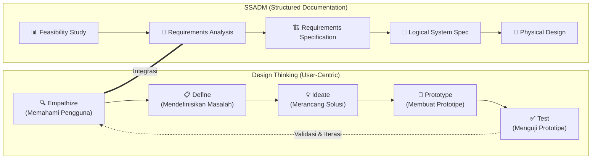
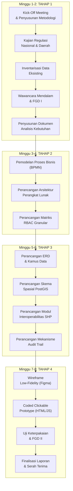
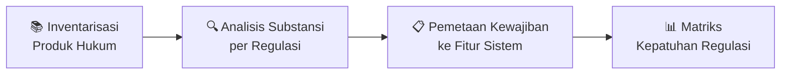
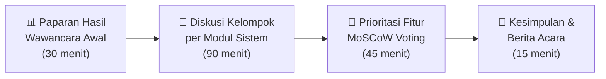
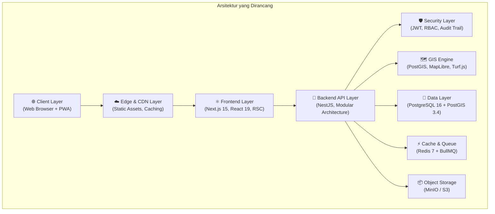
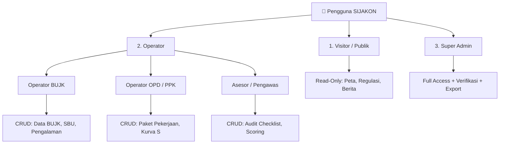
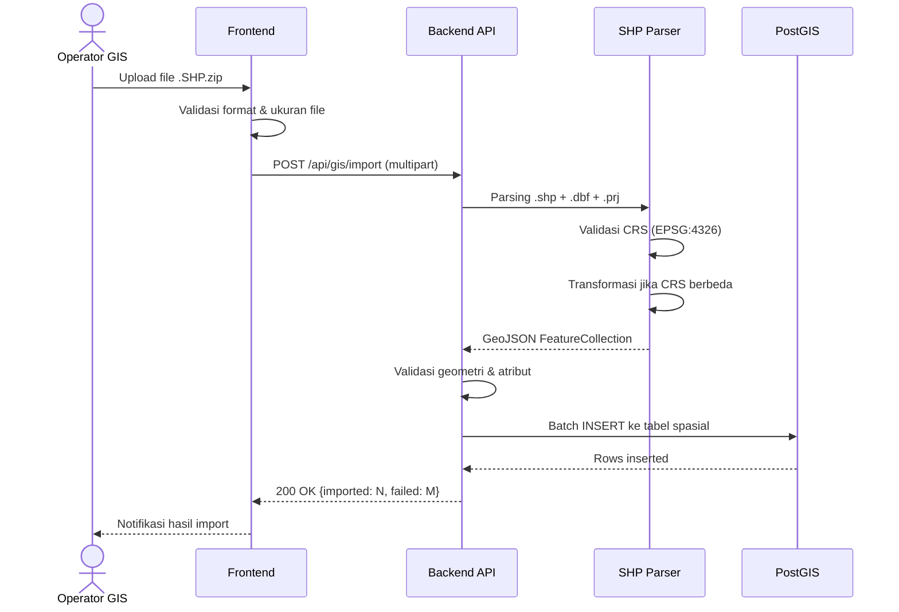
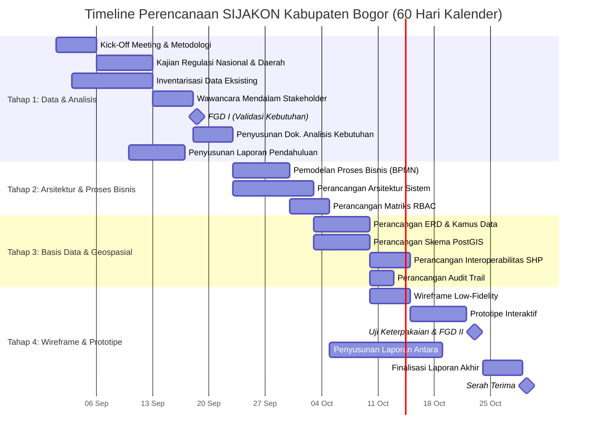
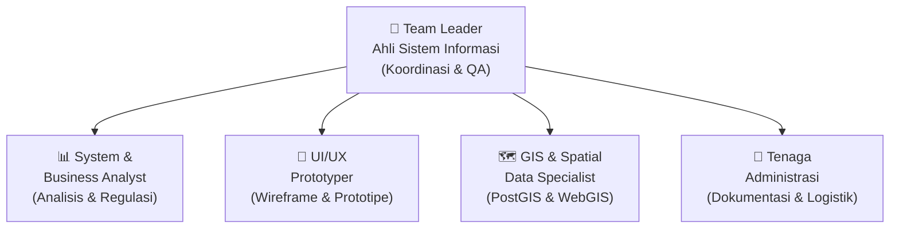
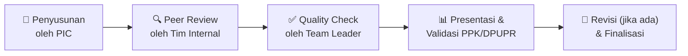

# METODOLOGI PERENCANAAN SISTEM
# PENYUSUNAN RANCANGAN DAN DED SISTEM INFORMASI JASA KONSTRUKSI (SIJAKON) KABUPATEN BOGOR

> **Bagian dari Laporan Pendahuluan (Inception Report)**
> Versi: 1.0.0 | September 2026

---

## 1. PENDAHULUAN

### 1.1 Latar Belakang Metodologi

Dokumen ini merupakan bagian dari **Laporan Pendahuluan (Inception Report)** yang disusun sebagai salah satu deliverable Jasa Konsultansi Perencanaan: Penyusunan Rancangan dan DED Sistem Informasi Jasa Konstruksi (SIJAKON) Kabupaten Bogor Tahun Anggaran 2026.

Metodologi perencanaan ini dirancang untuk menjamin bahwa seluruh keluaran pekerjaan — mulai dari analisis kebutuhan hingga prototipe antarmuka — disusun secara **sistematis, terukur, dan selaras dengan kerangka regulasi** yang berlaku, meliputi:

- **UU No. 2/2017** tentang Jasa Konstruksi jo. UU No. 6/2023 tentang Cipta Kerja;
- **PP No. 22/2020** jo. PP No. 14/2021 tentang Peraturan Pelaksanaan UU Jasa Konstruksi;
- **Permen PUPR No. 1/2023** tentang Pedoman Pengawasan Penyelenggaraan Jasa Konstruksi oleh Pemerintah Daerah;
- **Perda Provinsi Jawa Barat No. 6/2024** tentang Pembinaan dan Pengawasan Jasa Konstruksi;
- **Permen PUPR No. 9/2020** tentang Pembentukan Lembaga Pengembangan Jasa Konstruksi.

### 1.2 Tujuan Dokumen Metodologi

Dokumen ini bertujuan untuk:

1. Memberikan kerangka kerja (*framework*) yang jelas dan terstruktur bagi seluruh tim konsultan perencana dalam melaksanakan setiap tahapan pekerjaan;
2. Menetapkan pendekatan, teknik, dan alat bantu yang akan digunakan pada setiap fase perencanaan;
3. Menjamin konsistensi dan kualitas seluruh dokumen keluaran (*deliverables*);
4. Memberikan acuan kepada Tim Teknis DPUPR Kabupaten Bogor untuk mengawasi dan mengevaluasi kemajuan pekerjaan.

### 1.3 Ruang Lingkup Metodologi

Metodologi ini mencakup **seluruh tahapan perencanaan** sesuai Kerangka Acuan Kerja (KAK), yang meliputi:

| Tahap | Nama Tahapan | Output Utama |
| :---: | :--- | :--- |
| **1** | Pengumpulan Data & Analisis Kebutuhan | Dokumen Analisis Kebutuhan Pengguna (*User Requirement Analysis*) |
| **2** | Perancangan Arsitektur Sistem & Proses Bisnis | Dokumen Arsitektur Sistem & BPMN Proses Bisnis |
| **3** | Perancangan Basis Data & Geospasial (DED Data Model) | ERD, Kamus Data, Skema PostGIS |
| **4** | Perancangan Wireframe & Prototipe Antarmuka Interaktif | Wireframe (Figma) & *Coded Clickable Prototype* (HTML/CSS/JS) |

> [!IMPORTANT]
> Lingkup pekerjaan ini **murni berfokus pada tahapan perencanaan, perancangan, dan penyusunan cetak biru sistem** (*blueprint*). Tidak mencakup implementasi *live coding* di server produksi.

---

## 2. KERANGKA PENDEKATAN METODOLOGI

### 2.1 Pendekatan Umum

Perencanaan SIJAKON Kabupaten Bogor mengadopsi pendekatan **Design Thinking yang dimodifikasi** dan dikombinasikan dengan **Structured Systems Analysis and Design Method (SSADM)** untuk konteks proyek pemerintah. Kombinasi ini dipilih karena:

- **Design Thinking** menekankan empati terhadap pengguna akhir (stakeholder DPUPR, Operator BUJK, Tim Pengawas) sehingga menghasilkan rancangan yang *user-centric*;
- **SSADM** memberikan struktur formal dan dokumentasi yang ketat, sesuai dengan standar dokumentasi proyek pemerintah.



### 2.2 Prinsip-Prinsip Metodologi

Seluruh kegiatan perencanaan dilandasi oleh prinsip-prinsip berikut:

| No | Prinsip | Penjelasan |
| :---: | :--- | :--- |
| 1 | **Keselarasan Regulasi** (*Regulatory Alignment*) | Setiap rancangan sistem harus selaras dengan hierarki regulasi jasa konstruksi (UU, PP, Permen, Perda) |
| 2 | **Berpusat pada Pengguna** (*User-Centric Design*) | Rancangan didasarkan pada kebutuhan nyata pengguna melalui wawancara langsung dan FGD |
| 3 | **Berbasis Data** (*Data-Driven*) | Keputusan perancangan didasarkan pada data inventarisasi eksisting dan bukti empiris |
| 4 | **Iteratif & Bertahap** (*Iterative & Incremental*) | Setiap tahap menghasilkan keluaran yang dapat direview dan diperbaiki sebelum lanjut ke tahap berikutnya |
| 5 | **Interoperabilitas** (*Interoperability*) | Rancangan mempertimbangkan kemampuan integrasi dengan SIPJAKI nasional dan sistem pemerintah daerah lainnya |
| 6 | **Kesadaran Spasial** (*Spatial Awareness*) | Dimensi geospasial menjadi komponen integral dalam setiap aspek perancangan (40 Kecamatan Kab. Bogor) |
| 7 | **Dokumentasi Menyeluruh** (*Comprehensive Documentation*) | Setiap keputusan perancangan terdokumentasi dengan baik beserta rasionalnya |

---

## 3. TAHAPAN METODOLOGI PERENCANAAN

### 3.1 Gambaran Umum Tahapan



---

### 3.2 TAHAP 1 — Pengumpulan Data & Analisis Kebutuhan

**Periode**: Minggu ke-1 s.d. Minggu ke-2 (Hari 1–14)
**Penanggung Jawab Utama**: System & Business Analyst + Team Leader

#### 3.2.1 Kick-Off Meeting & Penyusunan Metodologi

| Aspek | Detail |
| :--- | :--- |
| **Tujuan** | Menyamakan persepsi antara Tim Konsultan dan Tim Teknis DPUPR mengenai lingkup, timeline, ekspektasi, dan mekanisme koordinasi |
| **Peserta** | Team Leader, seluruh tenaga ahli, PPK, Tim Teknis DPUPR, perwakilan bidang terkait |
| **Output** | Berita Acara Kick-Off, Rencana Kerja Detil, Dokumen Metodologi (dokumen ini) |
| **Teknik** | Presentasi, diskusi terstruktur, penetapan *contact person* & jalur komunikasi |

**Agenda Kick-Off Meeting:**
1. Paparan Lingkup Pekerjaan (Team Leader)
2. Presentasi Metodologi Perencanaan (Team Leader)
3. Konfirmasi Jadwal & Milestone (PPK + Team Leader)
4. Identifikasi Awal Stakeholder Kunci (Business Analyst)
5. Penetapan Mekanisme Koordinasi & Pelaporan
6. Diskusi & Tanya Jawab
7. Penandatanganan Berita Acara

#### 3.2.2 Kajian Regulasi Jasa Konstruksi

**Tujuan**: Memastikan seluruh rancangan sistem selaras dengan kerangka hukum yang berlaku.

**Metode Pelaksanaan:**



**Regulasi yang Dikaji:**

| No | Produk Hukum | Aspek yang Dikaji | Relevansi terhadap Sistem |
| :---: | :--- | :--- | :--- |
| 1 | UU No. 2/2017 jo. UU No. 6/2023 | Kewenangan pembinaan pemda, klasifikasi BUJK, sertifikasi TKK | Modul BUJK, SBU, TKK |
| 2 | PP No. 22/2020 jo. PP No. 14/2021 | Ketentuan pelaksana: registrasi, perizinan, pengawasan | Alur kerja registrasi & verifikasi |
| 3 | Permen PUPR No. 1/2023 | Pedoman pengawasan jakon: instrumen audit, indikator ketertiban, mekanisme pelaporan | Modul Pengawasan Tertib (Checklist, Scoring) |
| 4 | Permen PUPR No. 9/2020 | Pembentukan LPJK, data badan usaha | Integrasi data LPJK |
| 5 | Perda Jabar No. 6/2024 | Pembinaan dan pengawasan jakon tingkat provinsi | Laporan ke provinsi |

**Output**: *Matriks Kepatuhan Regulasi (Regulatory Compliance Matrix)* — tabel pemetaan pasal regulasi ke fitur/modul sistem.

#### 3.2.3 Inventarisasi Data Eksisting

**Tujuan**: Mengidentifikasi dan mengukur kesiapan data yang tersedia di DPUPR dan instansi terkait.

**Metode Pelaksanaan:**

| Jenis Data | Sumber | Teknik Pengumpulan | Format yang Diharapkan |
| :--- | :--- | :--- | :--- |
| Profil BUJK terdaftar | Bidang Jakon DPUPR | Permintaan data resmi, observasi arsip | Excel / Database |
| Data proyek konstruksi APBD | Bidang Jakon / PPK | Permintaan data, wawancara | Excel / Manual |
| Riwayat sertifikasi TKK | LPJK Kab. Bogor | Koordinasi & permintaan data | Excel / SIPJAKI |
| Data spasial kecamatan | Bappedalitbang / BIG | Permintaan data shapefile | SHP / GeoJSON |
| Regulasi & SOP internal | Bagian Hukum DPUPR | Studi dokumen | PDF / Hardcopy |
| Sistem informasi eksisting | IT DPUPR / OPD terkait | Observasi & demo sistem | Akses langsung |

**Instrumen Pengumpulan Data:**
- Formulir inventarisasi data terstruktur
- Checklist kelengkapan data per kategori
- Template audit kualitas data (*Data Quality Assessment*)

**Output**: *Dokumen Inventarisasi & Penilaian Kualitas Data Eksisting*

#### 3.2.4 Wawancara Mendalam & Focus Group Discussion (FGD I)

##### A. Wawancara Mendalam (*In-Depth Interview*)

**Tujuan**: Menggali kebutuhan, pain points, dan ekspektasi dari perspektif pengguna kunci secara individual.

**Narasumber & Topik:**

| No | Narasumber | Topik Wawancara | Durasi |
| :---: | :--- | :--- | :---: |
| 1 | Kepala Bidang Jasa Konstruksi | Visi digitalisasi, KPI pengawasan, hambatan tata kelola | 60 menit |
| 2 | Verifikator BUJK/SBU | Alur verifikasi eksisting, kendala validasi dokumen, volume kerja | 45 menit |
| 3 | Tim Pengawas Lapangan (Asesor) | Proses audit tertib konstruksi, kebutuhan mobile, format pelaporan | 45 menit |
| 4 | Staf Pelatihan & TKK | Alur sertifikasi TKK, manajemen pelatihan, pencetakan sertifikat | 45 menit |
| 5 | Perwakilan Asosiasi BUJK | Kendala registrasi, kebutuhan informasi, harapan terhadap sistem | 45 menit |
| 6 | Staf IT / Pengelola Data | Infrastruktur IT eksisting, bandwidth, kapabilitas server | 45 menit |

**Teknik Wawancara:**
- Menggunakan panduan wawancara semi-terstruktur (*semi-structured interview guide*)
- Setiap sesi direkam (audio) dengan persetujuan narasumber
- Catatan lapangan (*field notes*) ditulis langsung oleh tenaga pendukung
- Hasil ditranskrip dan dikoding (*thematic coding*) dalam waktu 2 hari kerja

##### B. Focus Group Discussion (FGD I)

**Tujuan**: Memvalidasi temuan awal, membangun konsensus kebutuhan lintas bagian, dan mengidentifikasi prioritas fitur.

| Aspek | Detail |
| :--- | :--- |
| **Peserta** | 8–12 orang: perwakilan Bidang Jakon, Verifikator, Tim Pengawas, IT DPUPR, perwakilan BUJK |
| **Fasilitator** | System & Business Analyst |
| **Notulen** | Tenaga Administrasi |
| **Durasi** | 3–4 jam |
| **Lokasi** | Ruang rapat DPUPR Kabupaten Bogor |

**Alur Pelaksanaan FGD I:**



**Teknik Fasilitasi:**
- **Card Sorting**: Peserta mengelompokkan fitur-fitur yang dibutuhkan ke dalam kategori modul
- **MoSCoW Prioritization**: Setiap fitur dikelompokkan menjadi Must Have, Should Have, Could Have, Won't Have
- **Dot Voting**: Peserta memberikan suara prioritas pada fitur-fitur kritis
- **Scenario Walkthrough**: Simulasi alur kerja menggunakan studi kasus nyata proyek konstruksi di Kab. Bogor

**Output FGD I**: Berita Acara FGD, Matriks Kebutuhan Fitur Tervalidasi, Dokumen Prioritas MoSCoW

#### 3.2.5 Penyusunan Dokumen Analisis Kebutuhan Pengguna

**Tujuan**: Menyintesis seluruh temuan dari kajian regulasi, inventarisasi data, wawancara, dan FGD menjadi dokumen formal kebutuhan pengguna.

**Struktur Dokumen Analisis Kebutuhan:**

```text
1. Pendahuluan & Metodologi Analisis
2. Profil Stakeholder & Peta Pengguna (User Persona)
3. Analisis Kondisi Eksisting (AS-IS)
   3.1 Proses Bisnis Saat Ini
   3.2 Infrastruktur IT Eksisting
   3.3 Kendala & Pain Points
4. Analisis Kebutuhan (TO-BE)
   4.1 Kebutuhan Fungsional per Modul
   4.2 Kebutuhan Non-Fungsional
   4.3 Kebutuhan Data & Integrasi
   4.4 Kebutuhan Geospasial
5. Matriks Prioritas MoSCoW
6. Matriks Kepatuhan Regulasi
7. Analisis Gap (AS-IS vs TO-BE)
8. Rekomendasi Pendekatan Solusi
```

**Teknik Analisis yang Digunakan:**
- **SWOT Analysis** — untuk mengidentifikasi kekuatan, kelemahan, peluang, dan ancaman terkait digitalisasi
- **Gap Analysis (AS-IS vs TO-BE)** — untuk mengidentifikasi kesenjangan antara kondisi saat ini dan kondisi yang diinginkan
- **User Persona Mapping** — untuk memahami karakteristik dan kebutuhan setiap tipe pengguna
- **Use Case Modeling** — untuk mendokumentasikan interaksi pengguna dengan sistem

---

### 3.3 TAHAP 2 — Perancangan Arsitektur Sistem & Proses Bisnis

**Periode**: Minggu ke-3 s.d. Minggu ke-4 (Hari 15–28)
**Penanggung Jawab Utama**: Team Leader + GIS & Spatial Data Specialist

#### 3.3.1 Pemodelan Proses Bisnis (BPMN)

**Tujuan**: Mendokumentasikan alur proses bisnis jasa konstruksi dalam notasi standar yang dapat dipahami oleh seluruh stakeholder.

**Standar Notasi**: Business Process Model and Notation (BPMN) 2.0

**Proses Bisnis yang Dimodelkan:**

| No | Proses Bisnis | Aktor Utama | Kompleksitas |
| :---: | :--- | :--- | :---: |
| 1 | Registrasi & Pendaftaran BUJK | Operator BUJK, Admin | Tinggi |
| 2 | Verifikasi Dokumen SBU & Legalitas | Verifikator, Super Admin | Tinggi |
| 3 | Pencatatan Pengalaman Kerja Konstruksi | Operator BUJK | Sedang |
| 4 | Input & Monitoring Paket Pekerjaan (Kurva S) | Operator OPD/PPK | Tinggi |
| 5 | Penjadwalan & Pelaksanaan Pengawasan Tertib Konstruksi | Super Admin, Asesor | Tinggi |
| 6 | Pengisian Checklist Audit (Permen PUPR 1/2023) | Asesor/Tim Pengawas | Tinggi |
| 7 | Manajemen Pelatihan & Sertifikasi TKK | Admin Pelatihan | Sedang |
| 8 | Pembuatan Laporan Eksekutif Multi-Format | Super Admin | Sedang |
| 9 | Import/Export Data Spasial (SHP) | Operator GIS | Sedang |

**Teknik Pemodelan:**
- Setiap proses bisnis dimodelkan dalam 3 level detail:
  - **Level 0** — *Context Diagram* (gambaran umum)
  - **Level 1** — *Main Process Flow* (alur utama dengan swimlane per aktor)
  - **Level 2** — *Detailed Sub-Process* (sub-proses detail termasuk exception handling)
- Menggunakan *swimlane diagrams* untuk menunjukkan interaksi antar-aktor
- Setiap proses memiliki *business rules* terdokumentasi

**Tools**: Diagrams.net (draw.io), Bizagi Modeler, atau BPMN.io

#### 3.3.2 Perancangan Arsitektur Perangkat Lunak

**Tujuan**: Menyusun cetak biru arsitektur teknis yang menjadi pedoman implementasi di tahap pembangunan.

**Pendekatan Arsitektur**: Modular Monolith yang dipersiapkan untuk evolusi ke Microservices.

**Komponen Arsitektur yang Dirancang:**



**Dokumen Arsitektur yang Dihasilkan:**

| No | Dokumen | Isi |
| :---: | :--- | :--- |
| 1 | *Architecture Overview Document* | Gambaran umum arsitektur, layer, dan alur data |
| 2 | *Technology Stack Justification* | Rasional pemilihan setiap teknologi yang direkomendasikan |
| 3 | *Architecture Decision Records (ADR)* | Catatan setiap keputusan arsitektur beserta konteks dan konsekuensinya |
| 4 | *Component Diagram* | Diagram komponen dan ketergantungan antar-modul |
| 5 | *Deployment Architecture* | Topologi deployment (Docker, reverse proxy, backup) |
| 6 | *Integration Architecture* | Pola integrasi dengan sistem eksternal (SIPJAKI, SIMAK) |

**Teknik Evaluasi Arsitektur:**
- **ATAM (Architecture Tradeoff Analysis Method)** — untuk mengevaluasi *quality attributes* (performance, security, scalability, maintainability)
- **ADR (Architecture Decision Record)** — untuk mendokumentasikan setiap keputusan arsitektur

#### 3.3.3 Perancangan Matriks RBAC Granular

**Tujuan**: Merancang sistem otorisasi berbasis peran yang granular sesuai ketentuan KAK.

**Pendekatan**: Role-Based Access Control (RBAC) dengan *permission matrix* per modul dan per aksi.

**Tingkatan Peran:**



**Output**: *RBAC Permission Matrix* — tabel detail yang memetakan setiap peran ke modul, sub-modul, dan aksi (Create, Read, Update, Delete, Export, Verify).

---

### 3.4 TAHAP 3 — Perancangan Basis Data & Geospasial (DED Data Model)

**Periode**: Minggu ke-5 s.d. Minggu ke-6 (Hari 29–42)
**Penanggung Jawab Utama**: Team Leader + GIS & Spatial Data Specialist

#### 3.4.1 Perancangan Skema Basis Data Relasional

**Tujuan**: Menyusun model data relasional yang ternormalisasi, efisien, dan mendukung seluruh kebutuhan fungsional.

**Pendekatan Perancangan:**

| Fase | Aktivitas | Output |
| :--- | :--- | :--- |
| **Logical Design** | Identifikasi entitas, atribut, dan relasi dari analisis kebutuhan | *Conceptual ERD* (Entity Relationship Diagram) |
| **Normalization** | Normalisasi hingga 3NF (Third Normal Form) untuk menghilangkan redundansi | *Normalized ERD* |
| **Physical Design** | Penentuan tipe data, indeks, constraint, dan optimasi query | *Physical Data Model* + *Data Dictionary* |

**Entitas Utama yang Dirancang:**

| Domain | Entitas | Deskripsi |
| :--- | :--- | :--- |
| **Pengguna** | `users`, `roles`, `permissions`, `role_permissions` | Manajemen pengguna & otorisasi |
| **BUJK** | `bujk_master`, `bujk_sbu`, `bujk_experiences`, `bujk_pj` | Data badan usaha jasa konstruksi |
| **Proyek** | `bujk_projects`, `project_progress`, `progress_images` | Paket pekerjaan & kurva S |
| **Pengawasan** | `supervision_schedules`, `supervision_inspections`, `inspection_items`, `inspection_evidences` | Audit Permen PUPR 1/2023 |
| **Pelatihan** | `trainings`, `training_participants`, `certificates` | Pelatihan & sertifikasi TKK |
| **Geospasial** | `kecamatan_boundaries`, `project_locations`, `spatial_layers` | Data spasial 40 kecamatan |
| **CMS** | `articles`, `regulations`, `announcements` | Konten publik |
| **Audit** | `audit_logs` | Jejak audit seluruh aktivitas |

**Kamus Data (Data Dictionary)** akan mencakup untuk setiap entitas:
- Nama kolom, tipe data, ukuran, nullable, default value
- Primary key, foreign key, unique constraints
- Deskripsi bisnis setiap kolom
- Contoh data

**Tools**: dbdiagram.io, Draw.io (ERD), Prisma Schema Language

#### 3.4.2 Perancangan Struktur Data Spasial (PostGIS)

**Tujuan**: Merancang model data geospasial yang mendukung pemetaan 40 kecamatan, lokasi proyek, dan analisis spasial.

**Standar yang Digunakan:**
- Sistem Koordinat: **EPSG:4326** (WGS 84) sebagai standar penyimpanan
- Tipe Geometry: `POINT` (lokasi proyek), `POLYGON` (batas kecamatan, area proyek), `MULTIPOLYGON` (batas wilayah)
- Engine: **PostGIS 3.4** extension di atas PostgreSQL 16

**Komponen Spasial yang Dirancang:**

| No | Komponen | Tipe Geometry | Sumber Data |
| :---: | :--- | :--- | :--- |
| 1 | Batas administratif 40 kecamatan | `MULTIPOLYGON` | BIG / Bappedalitbang |
| 2 | Titik lokasi proyek konstruksi | `POINT` | Input via map picker |
| 3 | Area/poligon proyek | `POLYGON` | Input via polygon draw / SHP import |
| 4 | Lokasi kantor BUJK | `POINT` | Geocoding alamat |
| 5 | Sebaran TKK tersertifikasi | `POINT` | Data pelatihan |

**Perancangan Indeks Spasial:**
- GiST Index pada semua kolom geometry untuk percepatan query `ST_Contains`, `ST_Intersects`, `ST_DWithin`
- BRIN Index pada kolom temporal untuk query rentang waktu

**Output**: *Spatial Data Model Document*, *PostGIS Schema Definition*, *Spatial Query Patterns Catalog*

#### 3.4.3 Perancangan Modul Interoperabilitas SHP & GeoJSON

**Tujuan**: Merancang mekanisme import dan export data spasial dalam format standar GIS.

**Format yang Didukung:**

| Format | Operasi | Engine yang Direkomendasikan |
| :--- | :--- | :--- |
| **Shapefile (.SHP zipped)** | Import & Export | `shpjs` (parser), `@turf/turf` (analisis) |
| **GeoJSON** | Import & Export | Native JSON handling |
| **KML** | Export (opsional) | Konversi dari GeoJSON |

**Alur Import SHP yang Dirancang:**



#### 3.4.4 Perancangan Mekanisme Audit Trail

**Tujuan**: Merancang sistem pencatatan seluruh aktivitas pengguna yang mengubah data (*data-mutating actions*).

**Atribut yang Dicatat:**

| Kolom | Tipe | Deskripsi |
| :--- | :--- | :--- |
| `id` | UUID | Identifier unik log |
| `user_id` | UUID (FK) | Pengguna yang melakukan aksi |
| `action` | ENUM | CREATE, UPDATE, DELETE, LOGIN, EXPORT, VERIFY |
| `entity_type` | VARCHAR | Nama entitas/tabel yang terdampak |
| `entity_id` | UUID | ID record yang terdampak |
| `old_values` | JSONB | Nilai sebelum perubahan (nullable) |
| `new_values` | JSONB | Nilai setelah perubahan (nullable) |
| `ip_address` | INET | Alamat IP pengguna |
| `user_agent` | TEXT | Browser/device pengguna |
| `created_at` | TIMESTAMPTZ | Waktu aksi dilakukan |

**Output**: *Audit Trail Design Specification*

---

### 3.5 TAHAP 4 — Perancangan Wireframe & Prototipe Antarmuka Interaktif

**Periode**: Minggu ke-7 s.d. Minggu ke-8 (Hari 43–60)
**Penanggung Jawab Utama**: UI/UX Prototyper + Team Leader

#### 3.5.1 Pembuatan Wireframe (Low-Fidelity)

**Tujuan**: Membuat sketsa tata letak visual seluruh halaman dan modul sistem tanpa elemen visual detail.

**Pendekatan**: *Content-First Design* — mengutamakan hierarki informasi dan alur navigasi sebelum estetika visual.

**Halaman yang Diwireframe-kan:**

| No | Modul | Halaman | Fitur Khusus |
| :---: | :--- | :--- | :--- |
| 1 | **Publik** | Landing Page, Regulasi, Berita | Peta sebaran publik |
| 2 | **Auth** | Login, Register, Lupa Password | Multi-role login |
| 3 | **Dashboard** | Ringkasan Statistik Eksekutif | Widget KPI, chart, mini-map |
| 4 | **BUJK** | Daftar BUJK, Detail, Form Stepper | *Multi-Step Stepper Wizard* |
| 5 | **SBU** | Daftar SBU, Verifikasi | *Side-by-Side Document Reviewer Modal* |
| 6 | **WebGIS** | Peta Full-Screen, Split-View | *WebGIS Split-View* (Peta + Tabel) |
| 7 | **Pengawasan** | Jadwal, Checklist Audit, Scoring | Gauge skor real-time, upload foto |
| 8 | **Pelatihan** | Daftar, Peserta, e-Certificate | QR Code sertifikat |
| 9 | **Pelaporan** | Laporan Eksekutif, Export | Multi-format export |
| 10 | **Pengaturan** | Manajemen User, Role, Audit Log | Permission matrix |

**Tools**: Figma (wireframe mode), Balsamiq, atau Whimsical

> [!NOTE]
> Figma digunakan **hanya untuk tahap wireframe** (sketsa tata letak). Untuk prototipe interaktif, digunakan pendekatan *coded prototype* (lihat sub-bab 3.5.2).

#### 3.5.2 Pembuatan Prototipe Antarmuka Interaktif (*Coded Clickable Prototype*)

**Tujuan**: Membuat prototipe interaktif berbasis kode (*coded prototype*) yang dapat diklik, dinavigasi, dan dijalankan langsung di *web browser* untuk mensimulasikan pengalaman pengguna nyata.

> [!IMPORTANT]
> Prototipe **TIDAK** menggunakan Figma Prototype, melainkan dibangun sebagai **aplikasi web statis (HTML + CSS + JavaScript)** yang berjalan langsung di browser. Pendekatan ini dipilih karena:
> - **Lebih realistis** — interaksi, animasi, dan responsivitas terasa seperti aplikasi nyata
> - **Aksesibilitas tinggi** — stakeholder cukup membuka file HTML di browser, tanpa perlu akun Figma
> - **Portabel** — dapat diserahkan dalam flashdisk dan langsung dijalankan tanpa server
> - **Fondasi implementasi** — kode prototipe dapat diadaptasi ke tahap pembangunan sistem

**Pendekatan**: *High-Fidelity Coded Prototype* dengan:
- Dibangun menggunakan **HTML5 + CSS3 + Vanilla JavaScript** (atau framework ringan seperti Alpine.js)
- Navigasi antar-halaman yang berfungsi melalui *client-side routing* atau multi-page HTML
- Data simulasi menggunakan **JSON statis / hardcoded data** (tidak terhubung ke server backend atau database)
- Form input dengan validasi client-side dan *feedback visual* (toast, modal, stepper)
- Responsive design (Desktop ≥ 1024px + Mobile ≥ 375px)
- Identitas visual Pemerintah Kabupaten Bogor

**Batasan Prototipe (Scope Boundary):**

| Termasuk dalam Prototipe | TIDAK Termasuk dalam Prototipe |
| :--- | :--- |
| ✅ Navigasi antar-halaman lengkap | ❌ Koneksi ke server backend / API |
| ✅ Form input dengan validasi client-side | ❌ Penyimpanan data ke database |
| ✅ Tabel data dengan data sampel (JSON statis) | ❌ Autentikasi & otorisasi nyata |
| ✅ Visualisasi chart/grafik dengan data dummy | ❌ Upload file ke server |
| ✅ Peta interaktif (MapLibre/Leaflet) dengan GeoJSON statis | ❌ Proses backend (PDF generate, queue) |
| ✅ Animasi transisi dan micro-interaction | ❌ Integrasi sistem eksternal |
| ✅ Simulasi alur login (redirect tanpa auth nyata) | ❌ Multi-user / real-time |

**Alur Kerja yang Disimulasikan:**

| No | Alur Kerja | Skenario Simulasi | Aktor |
| :---: | :--- | :--- | :--- |
| 1 | Registrasi BUJK | Pengisian form stepper 4 langkah → Submit → Toast "Berhasil" → Redirect ke daftar | Operator BUJK |
| 2 | Verifikasi Dokumen | Admin membuka side-by-side viewer → Klik Approve/Reject → Status berubah | Super Admin |
| 3 | Interaksi Peta WebGIS | Zoom → Filter layer → Klik marker → Info popup dengan data sampel | Operator Dinas |
| 4 | Pengisian Checklist Audit | Centang item → Gauge skor berubah real-time (JS) → Preview hasil | Asesor |
| 5 | Export Laporan | Pilih modul → Pilih format → Simulasi download (file dummy) | Super Admin |

**Struktur File Prototipe:**

```text
prototype/
├── index.html                    # Landing page / beranda publik
├── login.html                    # Halaman login
├── dashboard.html                # Dashboard eksekutif
├── bujk/
│   ├── list.html                 # Daftar BUJK
│   ├── detail.html               # Detail BUJK
│   └── register.html             # Form stepper pendaftaran
├── webgis/
│   └── map.html                  # Peta interaktif split-view
├── pengawasan/
│   ├── schedule.html             # Jadwal pengawasan
│   └── checklist.html            # Checklist audit + scoring
├── pelaporan/
│   └── report.html               # Laporan eksekutif + export
├── assets/
│   ├── css/                      # Stylesheet (design system)
│   ├── js/                       # JavaScript interaksi
│   ├── data/                     # JSON statis (data sampel)
│   └── img/                      # Gambar, ikon, logo
└── README.html                   # Panduan penggunaan prototipe
```

**Tools Pengembangan Prototipe:**
- **Editor**: Visual Studio Code
- **Styling**: CSS3 Modern (Flexbox, Grid, Custom Properties) atau Tailwind CSS
- **Interaktivitas**: Vanilla JavaScript / Alpine.js
- **Peta**: MapLibre GL JS atau Leaflet dengan GeoJSON statis 40 kecamatan
- **Chart**: Chart.js atau Recharts (via CDN)
- **Ikon**: Lucide Icons / Heroicons

**Deliverable Prototipe:**
- Folder `prototype/` berisi seluruh file HTML, CSS, JS, dan aset — siap dijalankan langsung di browser
- File `README.html` berisi panduan penggunaan dan navigasi prototipe
- Screenshot per halaman dalam format PNG (untuk lampiran laporan cetak)

#### 3.5.3 Uji Keterpakaian Prototipe & FGD II

**Tujuan**: Memvalidasi rancangan antarmuka dan alur kerja dengan pengguna sesungguhnya sebelum finalisasi.

**Metode Pengujian:**

| Metode | Deskripsi | Peserta |
| :--- | :--- | :--- |
| **Task-Based Usability Test** | Peserta diminta menyelesaikan task tertentu menggunakan prototipe, dinilai berdasarkan keberhasilan dan waktu | 5–8 pengguna representatif |
| **Think-Aloud Protocol** | Peserta mengungkapkan pikiran saat berinteraksi dengan prototipe | Semua peserta uji |
| **System Usability Scale (SUS)** | Kuesioner standar 10 pertanyaan untuk mengukur *perceived usability* | Semua peserta uji |
| **FGD II (Review Kolektif)** | Diskusi kelompok untuk membahas temuan uji keterpakaian dan menyepakati perbaikan | 8–12 stakeholder |

**Task Skenario Pengujian:**

```text
Task 1: "Anda adalah operator BUJK baru. Daftarkan perusahaan Anda melalui form pendaftaran."
Task 2: "Anda adalah admin DPUPR. Verifikasi satu berkas SBU yang masuk."
Task 3: "Anda ingin melihat sebaran proyek APBD di Kecamatan Cibinong pada peta."
Task 4: "Anda adalah pengawas. Lakukan audit tertib usaha pada satu BUJK."
Task 5: "Download laporan rekapitulasi BUJK per kecamatan dalam format Excel."
```

**Metrik Evaluasi:**

| Metrik | Target |
| :--- | :--- |
| Task Completion Rate | ≥ 85% |
| Average Time on Task | Sesuai benchmark per task |
| Error Rate | ≤ 10% |
| SUS Score | ≥ 70 (di atas rata-rata) |
| User Satisfaction (Likert 1-5) | ≥ 4.0 |

**Output**: *Usability Test Report*, *Berita Acara FGD II*, *Daftar Perbaikan Prototipe*

---

## 4. JADWAL PELAKSANAAN & MILESTONES

### 4.1 Timeline Keseluruhan (60 Hari Kalender)



### 4.2 Milestone & Deliverables

| No | Milestone | Target Minggu | Deliverable |
| :---: | :--- | :---: | :--- |
| **M1** | Kick-Off Meeting | Minggu 1 | Berita Acara Kick-Off, Rencana Kerja, Dokumen Metodologi |
| **M2** | FGD I — Validasi Kebutuhan | Minggu 2 | Berita Acara FGD I, Matriks Kebutuhan Tervalidasi |
| **M3** | Penyerahan Laporan Pendahuluan | Minggu 3 | **Laporan Pendahuluan (Inception Report)** — 5 eksemplar |
| **M4** | Arsitektur & BPMN Selesai | Minggu 4 | Dokumen Arsitektur Sistem, BPMN Proses Bisnis, ADR |
| **M5** | DED Data Model Selesai | Minggu 6 | ERD, Kamus Data, Skema PostGIS, Spesifikasi Audit Trail |
| **M6** | Prototipe Selesai | Minggu 7 | Wireframe Figma + *Coded Clickable Prototype* (HTML/CSS/JS) |
| **M7** | FGD II — Review Prototipe | Minggu 7-8 | Berita Acara FGD II, Usability Test Report |
| **M8** | Penyerahan Laporan Antara | Minggu 7 | **Laporan Antara (Interim Report)** — 5 eksemplar |
| **M9** | Penyerahan Final | Minggu 8 | **Laporan Akhir, DED Final, Executive Summary** — 5 eksemplar |

---

## 5. ORGANISASI TIM & PEMBAGIAN TUGAS

### 5.1 Struktur Tim Konsultan Perencana



### 5.2 Matriks Tanggung Jawab (RACI)

| Aktivitas | Team Leader | Business Analyst | UI/UX Prototyper | GIS Specialist | Admin |
| :--- | :---: | :---: | :---: | :---: | :---: |
| Kick-Off Meeting | **A/R** | R | I | I | C |
| Kajian Regulasi | A | **R** | I | I | C |
| Inventarisasi Data | A | **R** | I | R | **C** |
| Wawancara & FGD | A | **R** | C | C | **C** |
| Analisis Kebutuhan | A | **R** | C | C | I |
| BPMN Proses Bisnis | **A/R** | **R** | I | I | I |
| Arsitektur Sistem | **A/R** | C | I | C | I |
| Perancangan RBAC | A | **R** | I | I | I |
| ERD & Kamus Data | **A/R** | R | I | C | I |
| Skema PostGIS | A | I | I | **R** | I |
| Interoperabilitas SHP | A | I | I | **R** | I |
| Wireframe | A | C | **R** | C | I |
| Prototipe Interaktif | A | C | **R** | C | I |
| Uji Keterpakaian | A | **R** | **R** | I | **C** |
| Laporan-Laporan | **A/R** | R | R | R | **C** |

> **Keterangan**: R = Responsible, A = Accountable, C = Consulted, I = Informed

---

## 6. MEKANISME KOORDINASI & PELAPORAN

### 6.1 Jadwal Koordinasi Rutin

| Jenis Koordinasi | Frekuensi | Peserta | Tujuan |
| :--- | :--- | :--- | :--- |
| **Rapat Internal Tim** | 2× per minggu (Senin & Kamis) | Seluruh tim konsultan | Sinkronisasi progress, pembahasan kendala |
| **Koordinasi dengan PPK** | 1× per minggu (Rabu) | Team Leader + PPK | Update progress, eskalasi kendala |
| **Presentasi Milestone** | Sesuai jadwal milestone | Seluruh tim + Tim Teknis DPUPR | Presentasi deliverable, persetujuan |
| **FGD Formal** | 2× selama proyek (FGD I & II) | Multi-stakeholder | Validasi kebutuhan & review prototipe |

### 6.2 Mekanisme Pelaporan

| Jenis Laporan | Waktu Penyerahan | Jumlah | Format |
| :--- | :--- | :--- | :--- |
| **Laporan Pendahuluan (Inception Report)** | Minggu ke-3 | 5 eksemplar + softcopy | Hardcopy + Flashdisk |
| **Laporan Antara (Interim Report)** | Minggu ke-7 | 5 eksemplar + softcopy | Hardcopy + Flashdisk |
| **Dokumen DED & Arsitektur (Final DED)** | Minggu ke-8 | 5 eksemplar + softcopy | Hardcopy + Flashdisk |
| **Berkas Prototipe Interaktif** | Minggu ke-8 | Softcopy | Folder `prototype/` (HTML/CSS/JS) + Screenshot PNG |
| **Laporan Akhir & Executive Summary** | Minggu ke-8 | 5 eksemplar + softcopy | Hardcopy + Flashdisk |

---

## 7. ALAT BANTU & TEKNOLOGI PENDUKUNG

### 7.1 Tools per Tahapan

| Tahap | Kegiatan | Tools yang Digunakan |
| :--- | :--- | :--- |
| **Tahap 1** | Dokumentasi & Analisis | Microsoft Office, Google Workspace, Notion/Obsidian |
| **Tahap 1** | Wawancara & FGD | Panduan wawancara, Voice recorder, Miro/FigJam |
| **Tahap 2** | Pemodelan BPMN | Bizagi Modeler, diagrams.net (draw.io), BPMN.io |
| **Tahap 2** | Arsitektur & Diagram | diagrams.net, Mermaid, Excalidraw |
| **Tahap 3** | ERD & Data Modeling | dbdiagram.io, DBeaver, Prisma Schema Language |
| **Tahap 3** | Spasial & GIS | QGIS, PostGIS, GeoJSON.io |
| **Tahap 4** | Wireframe (Low-Fidelity) | Figma (wireframe mode), Balsamiq |
| **Tahap 4** | Prototipe Interaktif (Coded) | VS Code, HTML5/CSS3/JS, MapLibre GL JS, Chart.js |
| **Tahap 4** | Uji Keterpakaian | SUS Questionnaire, Task Scenario Script |
| **Umum** | Manajemen Proyek | Trello / Linear / GitHub Projects |
| **Umum** | Komunikasi | WhatsApp Group, Email Resmi, Zoom/Meet |
| **Umum** | Penyimpanan Berkas | Google Drive / OneDrive (shared folder) |

### 7.2 Standar Format Dokumen

| Jenis Dokumen | Format File | Standar |
| :--- | :--- | :--- |
| Laporan Resmi | `.docx` / `.pdf` | Kop Surat, Penomoran BAB, Daftar Isi, Footer halaman |
| Diagram BPMN | `.bpmn` / `.svg` / `.png` | BPMN 2.0 Notation |
| ERD | `.prisma` / `.svg` / `.png` | Crow's Foot Notation |
| Wireframe | `.fig` / `.png` | Figma project (wireframe mode) |
| Prototipe | `.html` + `.css` + `.js` | Coded prototype, berjalan langsung di browser tanpa server |
| Data Spasial | `.shp` / `.geojson` | EPSG:4326, OGC Standard |

---

## 8. PENGENDALIAN MUTU (QUALITY ASSURANCE)

### 8.1 Mekanisme Review & Validasi

Setiap deliverable melalui **3 tahap validasi** sebelum diserahkan ke PPK:



### 8.2 Checklist Kualitas Dokumen

| No | Kriteria Kualitas | Standar |
| :---: | :--- | :--- |
| 1 | Kelengkapan konten sesuai KAK | Semua lingkup pekerjaan tercakup |
| 2 | Konsistensi terminologi | Istilah seragam di seluruh dokumen |
| 3 | Keselarasan regulasi | Setiap rancangan merujuk dasar hukum yang relevan |
| 4 | Kejelasan diagram & visualisasi | Diagram terbaca, memiliki legenda, dan konsisten |
| 5 | Kelayakan teknis | Rancangan dapat diimplementasikan dalam 90 hari (fase pembangunan) |
| 6 | Kemudahan pemahaman | Dapat dipahami oleh pembaca non-teknis (PPK, pimpinan) |
| 7 | Format & tata letak | Sesuai standar format dokumen resmi |

### 8.3 Kriteria Penerimaan per Deliverable

| Deliverable | Kriteria Penerimaan |
| :--- | :--- |
| **Laporan Pendahuluan** | Metodologi jelas, rencana kerja realistis, jadwal terperinci |
| **Laporan Antara** | Analisis kebutuhan tervalidasi FGD, proses bisnis lengkap, PRD detail |
| **DED & Arsitektur** | ERD ternormalisasi, arsitektur terjustifikasi, kamus data lengkap |
| **Prototipe** | Semua modul terwireframe, alur utama dapat diklik di browser (*coded prototype*), SUS ≥ 70 |
| **Laporan Akhir** | Komprehensif, executive summary ringkas, seluruh deliverable terlampir |

---

## 9. MANAJEMEN RISIKO PERENCANAAN

| No | Risiko | Dampak | Probabilitas | Strategi Mitigasi |
| :---: | :--- | :---: | :---: | :--- |
| 1 | Stakeholder kunci tidak tersedia untuk wawancara/FGD | Tinggi | Sedang | Jadwalkan jauh hari, siapkan alternatif narasumber, gunakan kuesioner tertulis sebagai fallback |
| 2 | Data eksisting tidak tersedia atau kualitas rendah | Tinggi | Tinggi | Gunakan data sampel/dummy untuk rancangan, dokumentasikan asumsi, koordinasi awal dengan sumber data |
| 3 | Data spasial 40 kecamatan tidak tersedia dari BIG/Bappedalitbang | Tinggi | Sedang | Siapkan data OpenStreetMap (OSM) sebagai alternatif, koordinasi paralel dengan BIG |
| 4 | Perubahan lingkup (*scope creep*) dari stakeholder | Sedang | Tinggi | Semua perubahan melalui mekanisme *Change Request* formal, patuhi MoSCoW yang sudah disepakati |
| 5 | Keterlambatan persetujuan dokumen oleh PPK/Tim Teknis | Sedang | Sedang | Sediakan *buffer time* di jadwal, komunikasikan timeline review sejak awal |
| 6 | Konflik kebutuhan antar-stakeholder | Sedang | Sedang | Resolusi melalui FGD dengan fasilitasi profesional, keputusan final oleh PPK |
| 7 | Rancangan arsitektur terlalu kompleks untuk timeline implementasi 90 hari | Tinggi | Rendah | Evaluasi via ATAM, terapkan *phased delivery*, prioritas fitur MoSCoW |

---

## 10. PENUTUP

Dokumen Metodologi Perencanaan ini disusun sebagai panduan komprehensif bagi seluruh tim konsultan perencana dan stakeholder DPUPR Kabupaten Bogor dalam melaksanakan kegiatan Penyusunan Rancangan dan DED Sistem Informasi Jasa Konstruksi (SIJAKON).

Metodologi ini bersifat **hidup (*living document*)** dan dapat diperbaharui sesuai kebutuhan dengan persetujuan bersama antara Tim Konsultan dan PPK DPUPR Kabupaten Bogor, dengan tetap menjaga keselarasan terhadap lingkup pekerjaan yang tercantum dalam Kerangka Acuan Kerja (KAK).

---

**Disusun oleh:**

Tim Konsultan Perencana SIJAKON Kabupaten Bogor
Tahun Anggaran 2026

| Jabatan | Nama | Tanda Tangan |
| :--- | :--- | :--- |
| **Team Leader / Ahli Sistem Informasi** | _________________________ | _____________ |
| **System & Business Analyst** | _________________________ | _____________ |
| **UI/UX Prototyper** | _________________________ | _____________ |
| **GIS & Spatial Data Specialist** | _________________________ | _____________ |

**Mengetahui,**
**Pejabat Pembuat Komitmen (PPK)**
Dinas Pekerjaan Umum dan Penataan Ruang
Kabupaten Bogor


**Bang Fauzy Tea**
NIP. ----------------------------
