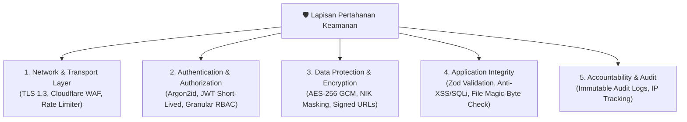

# Kebijakan Keamanan Sistem — SIJAKON BOGOR

> **Dokumen Standar Keamanan Informasi, Enkripsi & Perlindungan Data**
> Versi: 1.1.0 | Tanggal: September 2026

---

## 1. Prinsip Utama Keamanan Informasi

Sistem Informasi Jasa Konstruksi (SIJAKON) Kabupaten Bogor memproses data sensitif seperti data kependudukan (NIK), keuangan perusahaan (NPWP, Nilai Kontrak), dan dokumen legalitas badan usaha. Seluruh rancangan arsitektur berpedoman pada standar **ISO/IEC 27001**, **UU No. 27/2022 tentang Perlindungan Data Pribadi (PDP)**, dan standar keamanan aplikasi **OWASP Top 10 (2025/2026)**.



---

## 2. Autentikasi & Manajemen Sesi

### 2.1 Password Hashing & Policy
- Algoritma hashing wajib: **Argon2id** (memory cost: 64MB, time cost: 3 iterations, parallelism: 4) atau **Bcrypt** dengan `saltRounds = 12`.
- Kebijakan Password Pengguna:
  - Minimal **8 karakter** (Disarankan 12+).
  - Wajib kombinasi: Huruf besar, huruf kecil, angka, dan karakter simbol.
  - Maksimal 5 kali percobaan gagal berturut-turut sebelum akun terkunci selama **15 menit** (*Anti-Brute Force Account Lockout*).

### 2.2 Arsitektur JWT (JSON Web Token)
- **Access Token**: Masa berlaku **15 - 60 menit** (Short-lived), disimpan di `memory` atau `HttpOnly Secure Cookie`.
- **Refresh Token**: Masa berlaku **7 hari**, disimpan di `HttpOnly, Secure, SameSite=Strict` Cookie dengan mekanisme *Token Rotation* (setiap kali refresh token digunakan, token lama dihanguskan).
- Token Signing: Menggunakan kunci privat minimal **2048-bit RSA** (`RS256`) atau **HMAC-SHA256** dengan secret key berkekuatan 64+ karakter acak.

---

## 3. Matriks Hak Akses Granular (RBAC Matrix)

Sistem mengadopsi **6 peran** (5 login + 1 publik). Role `ADMIN_BIDANG` mencakup varian *Operator Bina Konstruksi*, *Operator Pelatihan*, dan *Tim Pengawas/Asesor* — dikonfigurasi via permission granular, bukan role terpisah.

| Modul & Sumber Daya | Publik | Peserta TKK | Operator BUJK | Admin Bidang | Eksekutif | Super Admin |
| :--- | :---: | :---: | :---: | :---: | :---: | :---: |
| **WebGIS Sebaran Proyek** | 👁️ Lihat Publik | — | 👁️ Lihat Publik | 👁️ Lihat & Filter | 👁️ Lihat & Filter | ⚙️ Kelola Layer |
| **Registrasi BUJK Mandiri** | ✍️ Buat Akun | — | ✍️ Buat Akun | — | — | — |
| **Registrasi Pelatihan TKK** | ✍️ Daftar Mandiri | ✍️ Daftar Mandiri | ✍️ Daftarkan Pegawai | 👁️ Seleksi Peserta | — | ⚙️ Kelola Paket |
| **Profil & SBU BUJK** | ❌ | — | ✏️ Kelola Sendiri | 👁️ Lihat & Verifikasi | 👁️ Lihat | ⚙️ Kelola Penuh |
| **Kurva S & Progres Proyek** | ❌ | — | ✍️ Input Progres | 👁️ Monitoring | 👁️ Lihat | ⚙️ Kelola Penuh |
| **Audit Pengawasan (Permen 1/2023)** | ❌ | — | 📤 Upload SIMAK | ✍️ Input Skor Audit | 👁️ Tinjau Rekap | ⚙️ Jadwal & Ekspor |
| **Penerbitan e-Certificate** | ❌ | 📥 Download Sendiri | ❌ | ✍️ Terbitkan Draft | ❌ | 🔏 Tanda Tangan & QR |
| **Validasi QR Code Publik** | 👁️ Verifikasi | 👁️ Verifikasi | 👁️ Verifikasi | 👁️ Verifikasi | 👁️ Verifikasi | 👁️ Verifikasi |
| **Dashboard Eksekutif** | ❌ | ❌ | ❌ | 👁️ Lihat | 👁️ Lihat (Utama) | ⚙️ Kelola Penuh |
| **Laporan Eksekutif (PDF/Excel)** | ❌ | ❌ | ❌ | 📥 Generate | 📥 Download | ⚙️ Kelola Penuh |
| **Manajemen User & RBAC** | ❌ | ❌ | ❌ | ❌ | ❌ | ⚙️ Kelola Penuh |
| **Audit Trail Logs** | ❌ | ❌ | ❌ | 👁️ Lihat | ❌ | 👁️ Audit Viewer |

---

## 4. Perlindungan Data Pribadi (UU PDP No. 27/2022)

### 4.1 Masking Data Sensitif pada UI
Untuk mencegah kebocoran data saat layar ditinjau bersama:
- **NIK (16 Digit)**: Ditampilkan ter-masking pada antarmuka umum: `3201************0004` (hanya admin dengan izin `user:view_pii` yang dapat melihat utuh).
- **NPWP**: Ditampilkan ter-masking: `01.***.***.*-403.000`.

### 4.2 Enkripsi Data Rest & In-Transit
- **In-Transit**: Seluruh koneksi jaringan wajib menggunakan **HTTPS / TLS 1.3** dengan sertifikat SSL/TLS dari otoritas terpercaya. Dukungan protokol TLS 1.0 dan TLS 1.1 dinonaktifkan.
- **At-Rest**: Storage database dan backup terenkripsi menggunakan **AES-256**. File PDF legalitas dan sertifikat disimpan di Object Storage privat dan hanya diakses via **Pre-Signed URLs** dengan waktu kedaluwarsa 15 menit.

---

## 5. Keamanan Input & File Upload Sanitization

### 5.1 Validasi Input (Anti-SQLi & Anti-XSS)
- Seluruh input dari client divalidasi ketat menggunakan skema **Zod** di sisi server sebelum diproses oleh business logic.
- Menggunakan parameterized query secara native via **Prisma ORM** (mencegah SQL Injection 100%).
- Semua output HTML di halaman web di-*escape* secara otomatis oleh engine **React / Next.js** untuk mencegah Cross-Site Scripting (XSS).

### 5.2 Aturan Validasi File Upload
1. **Pemeriksaan Magic Bytes**: Validasi tipe file tidak hanya mengandalkan ekstensi nama file, melainkan memeriksa header biner file (*magic bytes/MIME sniffing* via library `file-type`).
2. **Whitelist Ekstensi**:
   - Berkas Legalitas & Sertifikat: Hanya `.pdf`
   - Berkas Foto Proyek: Hanya `.jpg`, `.jpeg`, `.png`, `.webp`
   - Berkas Spasial: Hanya `.zip` (berisi `.shp`, `.shx`, `.dbf`, `.prj`)
   - Berkas Dokumen SIMAK: Hanya `.xlsx`, `.xls`
3. **Limit Ukuran Berkas**:
   - PDF Legalitas: Maksimal **5 MB**
   - Foto Proyek: Maksimal **3 MB** (otomatis di-kompres ke format WebP di sisi server)
   - Shapefile Zip: Maksimal **15 MB**
4. **Isolasi Storage**: File diunggah ke storage terisolasi dengan nama file acak (UUID v4) untuk mencegah eksekusi skrip jahat (*Unrestricted File Upload*).

---

## 6. HTTP Security Headers

Konfigurasi reverse proxy (Nginx / Cloudflare) wajib menyertakan header keamanan berikut:

```nginx
# HTTP Security Headers
add_header Strict-Transport-Security "max-age=31536000; includeSubDomains; preload" always;
add_header X-Frame-Options "SAMEORIGIN" always;
add_header X-Content-Type-Options "nosniff" always;
add_header X-XSS-Protection "1; mode=block" always;
add_header Referrer-Policy "strict-origin-when-cross-origin" always;
add_header Permissions-Policy "camera=(self), geolocation=(self), microphone=()" always;
add_header Content-Security-Policy "default-src 'self'; script-src 'self' 'unsafe-inline' 'unsafe-eval'; style-src 'self' 'unsafe-inline' https://fonts.googleapis.com; font-src 'self' https://fonts.gstatic.com; img-src 'self' data: blob: https:; connect-src 'self' https:;" always;
```

---

## 7. Rate Limiting & Proteksi DDoS

| Endpoint Group | Limit per IP | Window | Aksi Pelanggaran |
| :--- | :---: | :---: | :--- |
| `/api/v1/auth/login` | 5 request | 1 Menit | `429 Too Many Requests` + Captcha |
| `/api/v1/training/register` | 10 request | 1 Menit | `429 Too Many Requests` |
| `/api/v1/gis/*` | 120 request | 1 Menit | `429 Too Many Requests` |
| Seluruh Endpoint Lain | 300 request | 1 Menit | `429 Too Many Requests` |

---

*Kebijakan keamanan ini wajib dipatuhi dalam setiap baris kode, konfigurasi server, dan proses operasional sistem SIJAKON BOGOR.*
