# Product Requirement Document (PRD) Rekomendasi
# Sistem Informasi Jasa Konstruksi (SIJAKON) Kabupaten Bogor TA 2026

---

## 1. Dokumen Kontrol & Ringkasan Eksekutif

| Atribut | Detail Informasi |
| :--- | :--- |
| **Nama Produk** | **SIJAKON BOGOR** (Sistem Informasi Pembinaan & Pengawasan Jasa Konstruksi Kabupaten Bogor) |
| **Versi Dokumen** | 2.0.0 (Rekomendasi Arsitektur Baru) |
| **Pengguna Jasa** | Dinas Pekerjaan Umum (DPU) Kabupaten Bogor |
| **Sumber Dana** | APBD Kabupaten Bogor Tahun Anggaran 2026 |
| **Waktu Pelaksanaan** | 90 Hari Kalender |
| **Dasar Acuan** | [KAK APLIKASI JAKON BOGOR 2026.docx](file:///u:/Project/ciptabintar/KAK%20APLIKASI%20JAKON%20BOGOR%202026.docx) & Analisis Sistem SIBIJAK |
| **Dasar Regulasi** | • UU No. 2/2017 jo UU Cipta Kerja<br>• PP No. 22/2020 jo PP No. 14/2021<br>• **Permen PUPR No. 1/2023** (Pedoman Pengawasan Jakon Pemda)<br>• **Perda Prov. Jabar No. 6/2024** (Pembinaan & Pengawasan Jakon)<br>• Permen PUPR No. 9/2020 (LPJK) |

### 1.1 Ringkasan Produk & Nilai Strategis
SIJAKON BOGOR dirancang sebagai platform generasi baru yang mengintegrasikan seluruh alur kerja pembinaan, perizinan, sertifikasi, monitoring, pengawasan tertib konstruksi, dan pemetaan spasial di wilayah Kabupaten Bogor (yang mencakup **40 Kecamatan**).

Sistem ini menggabungkan **keunggulan alur kerja SIBIJAK** (pendaftaran, master BUJK, SBU, pengalaman, kurva S, pelatihan, dan RBAC granular) dengan **mandat KAK Bogor 2026** (WebGIS interaktif, dukungan format `.SHP`, instrumen audit digital Permen PUPR 1/2023, dan modul pelaporan eksekutif multi-format).

---

## 2. Struktur Peran Pengguna (User Hierarchy)

Sistem mengadopsi **6 tingkatan peran** (5 dengan login + 1 publik tanpa login) dengan matriks RBAC granular yang memungkinkan konfigurasi hak akses fleksibel tanpa mengubah kode:

```mermaid
graph TD
    A["Pengguna SIJAKON"] --> B["1. 🔴 Super Admin"]
    A --> C["2. 🟠 Admin Bidang"]
    A --> D["3. 🟣 Eksekutif"]
    A --> E["4. 🟢 Operator BUJK"]
    A --> F["5. 🟡 Peserta TKK"]
    A --> G["6. ⚪ Publik / Visitor"]

    B --> B1["Manajemen User & RBAC"]
    B --> B2["Audit Trail & Konfigurasi Sistem"]
    B --> B3["Full Access Seluruh Modul"]

    C --> C1["Varian A: Operator Bina Konstruksi"]
    C --> C2["Varian B: Operator Pelatihan"]
    C --> C3["Varian C: Tim Pengawas / Asesor"]
    C --> C4["Verifikasi, Penjadwalan, CMS"]

    D --> D1["Dashboard Ringkasan KPI"]
    D --> D2["Laporan Eksekutif Read-Only"]
    D --> D3["Download PDF/Excel/SHP"]

    E --> E1["Input SBU, Pengalaman, Progres"]
    E --> E2["Upload SIMAK"]
    E --> E3["Dashboard Perusahaan Sendiri"]

    F --> F1["Pendaftaran Pelatihan"]
    F --> F2["Download e-Certificate"]

    G --> G1["Peta WebGIS Publik"]
    G --> G2["Katalog Regulasi & Berita"]
    G --> G3["Validasi QR Code Sertifikat"]
    G --> G4["Self-Registration BUJK / TKK"]
```



### 2.1 Deskripsi Peran

| # | Peran | Sifat | Deskripsi | Self-Register |
| :---: | :--- | :--- | :--- | :---: |
| 1 | **Super Admin** | Internal Dinas | Full access seluruh sistem. Kelola user, group, RBAC, audit trail, backup. Hanya 1–2 orang (Kepala Seksi IT / Kepala Bidang). | ❌ Dibuat manual |
| 2 | **Admin Bidang** | Internal Dinas | Operator dinas dengan permission dikonfigurasi per bidang via RBAC granular. Mencakup varian: *Operator Bina Konstruksi*, *Operator Pelatihan*, dan *Tim Pengawas/Asesor*. | ❌ Dibuat Super Admin |
| 3 | **Eksekutif** | Internal Dinas | Read-only dashboard & laporan. Kepala Dinas, Sekretaris, PPK, Bupati. Tidak bisa menambah/mengubah/menghapus data operasional. | ❌ Dibuat Super Admin |
| 4 | **Operator BUJK** | Eksternal | Portal mandiri kontraktor. Hanya bisa melihat & mengedit data perusahaan sendiri (tenant-scoped via `bujk_id`). | ✅ Via pendaftaran |
| 5 | **Peserta TKK** | Eksternal | Portal peserta pelatihan. Pendaftaran pelatihan online, cek status seleksi, download e-Certificate. | ✅ Via pendaftaran |
| 6 | **Publik / Visitor** | Tanpa Login | Akses halaman publik: peta WebGIS, katalog regulasi, berita, validasi QR Code sertifikat. | — |

### 2.2 Matriks Permission per Modul

| Modul / Fitur | Super Admin | Admin Bidang | Eksekutif | Operator BUJK | Peserta TKK | Publik |
| :--- | :---: | :---: | :---: | :---: | :---: | :---: |
| Dashboard Eksekutif | FULL | VIEW | VIEW | — | — | — |
| Dashboard BUJK (Pribadi) | FULL | VIEW | — | VIEW/EDIT | — | — |
| WebGIS Peta | FULL | FULL | VIEW | VIEW | — | VIEW* |
| Master BUJK | FULL | CRUD | VIEW | Own Data | — | — |
| SBU & Pengalaman | FULL | CRUD | VIEW | Own Data | — | — |
| Progres Proyek & Kurva S | FULL | CRUD | VIEW | Own Data | — | — |
| Pendaftaran BUJK | FULL | VERIFY | — | SUBMIT | — | — |
| Pengawasan / SIMAK | FULL | SCHEDULE/ASSESS | VIEW | UPLOAD | — | — |
| Pelatihan (Paket) | FULL | CRUD | VIEW | — | — | — |
| Pelatihan (Peserta) | FULL | CRUD | VIEW | — | Own Data | — |
| Sertifikat | FULL | CRUD | VIEW | — | DOWNLOAD | VERIFY** |
| CMS (Regulasi/Berita) | FULL | CRUD | VIEW | — | — | VIEW |
| User Management | FULL | — | — | — | — | — |
| RBAC / Group Permission | FULL | — | — | — | — | — |
| Audit Trail | FULL | VIEW | — | — | — | — |
| Laporan Eksekutif | FULL | GENERATE | VIEW/DL | — | — | — |
| Export (Excel/PDF/SHP) | FULL | FULL | DOWNLOAD | Own Data | — | — |

> **VIEW*** = Peta publik dengan layer terbatas (tanpa data sensitif)
> **VERIFY**** = Hanya validasi keaslian sertifikat via QR Code scan

### 2.3 Varian Admin Bidang (Dikonfigurasi via RBAC Granular)

Role "Admin Bidang" tidak perlu dipecah menjadi role terpisah di database. Cukup satu role dengan permission yang dikonfigurasi oleh Super Admin sesuai penugasan bidang:

| Varian | Permission yang Diaktifkan |
| :--- | :--- |
| **Operator Bina Konstruksi** | BUJK (CRUD), SBU (CRUD), Pengalaman (CRUD), Proyek (CRUD), Pendaftaran (VERIFY) |
| **Operator Pelatihan** | Pelatihan (CRUD), Peserta (CRUD), Sertifikat (CRUD), Pendaftaran Pelatihan (VERIFY) |
| **Tim Pengawas / Asesor** | Pengawasan (CRUD), Checklist Audit (CREATE/UPDATE), Scoring (CREATE), BUJK (READ), Proyek (READ) |
| **Operator CMS** | Regulasi (CRUD), Berita (CRUD) |
| **Full Operator** | Semua permission di atas (untuk dinas kecil dengan staf terbatas) |

### 2.4 Kebijakan Keamanan per Peran

| Peran | Session Timeout | Self-Register | Portal Login |
| :--- | :---: | :---: | :--- |
| Super Admin | 30 menit | ❌ | `/admin` |
| Admin Bidang | 60 menit | ❌ | `/admin` |
| Eksekutif | 120 menit | ❌ | `/admin` |
| Operator BUJK | 60 menit | ✅ | `/portal` |
| Peserta TKK | 120 menit | ✅ | `/portal` |
| Publik | — | — | Tanpa login |

---

## 3. Blueprint Arsitektur Sistem & Stack Modern

Sistem dibangun menggunakan **Fullstack Modern TypeScript Architecture** untuk memastikan *end-to-end type safety*, antarmuka yang sangat responsif dan estetis (*WOW-factor UI*), serta kemampuan komputasi geospasial WebGIS berkecepatan tinggi:

```text
┌──────────────────────────────────────────────────────────────────────────────────────────┐
│                                 FRONTEND (CLIENT LAYER)                                  │
│           Next.js 15 (App Router) + React 19 + Tailwind CSS + Shadcn UI + Radix          │
│                WebGIS: MapLibre GL JS / React-Leaflet + Lucide Icons + Framer            │
└────────────────────────────────────────────┬─────────────────────────────────────────────┘
                                             │ REST API / JSON / Server Actions
┌────────────────────────────────────────────▼─────────────────────────────────────────────┐
│                                BACKEND (BUSINESS ENGINE)                                 │
│             NestJS / Hono.js (Modular Enterprise Clean Architecture, TypeScript)         │
│      • ORM: Prisma / Drizzle ORM (Type-Safe)  • Auth: JWT + RBAC Granular Matrix         │
│      • Spatial: @turf/turf + shpjs (Shapefile Parser)  • PDF: Puppeteer / @react-pdf     │
│      • Spreadsheet: ExcelJS / SheetJS  • Export Engine: Multi-Format (SHP/XLS/PDF)       │
└───────────────────────┬──────────────────────────────────┬───────────────────────────────┘
                        │                                  │
┌───────────────────────▼────────┐               ┌─────────▼────────┐
│     DATABASE & SPATIAL         │               │ CACHE & WORKERS  │
│     PostgreSQL 16 + PostGIS    │               │  Redis + BullMQ  │
│ (Data Relasional + GeoJSON/SHP)│               │(PDF/Excel Queues)│
└────────────────────────────────┘               └──────────────────┘
```

---

## 4. Spesifikasi Kebutuhan Fungsional (Functional Requirements)

Prioritas fitur menggunakan standar **MoSCoW**:
- **[M] Must Have** (Wajib rilis dalam 90 hari)
- **[S] Should Have** (Sangat penting)
- **[C] Could Have** (Peningkatan fitur lanjutan)

### 4.1 Modul 1: WebGIS & Pemetaan Spasial (Epic-GIS) — *Fitur Baru KAK 2026*

| ID | Kebutuhan Fungsional | Deskripsi & Aturan Bisnis | Prioritas |
| :--- | :--- | :--- | :---: |
| **FR-GIS-01** | Peta Interaktif Sebaran Proyek | Menampilkan peta digital berbasis GPU-accelerated (**MapLibre GL JS / Leaflet**) dengan layer sebaran lokasi paket pekerjaan konstruksi di seluruh 40 Kecamatan Kab. Bogor. | **M** |
| **FR-GIS-02** | Layer Tematik Multi-Kategori | Pengguna dapat mengaktifkan filter layer: (1) Sebaran Proyek APBD/APBN, (2) Sebaran Kantor BUJK (Kecil/Menengah/Besar), (3) Sebaran TKK tersertifikasi. | **M** |
| **FR-GIS-03** | Geocoding & Input Koordinat | Form input proyek dilengkapi peta picker untuk memilih titik koordinat (Latitude/Longitude) atau menggambar poligon area proyek via **Mapbox Draw / Leaflet Geoman**. | **M** |
| **FR-GIS-04** | Import & Export File `.SHP` | Sistem mendukung unggah (*upload*) dan unduh (*download*) data spasial dalam format **Shapefile (.SHP zipped)** dan **GeoJSON** via engine **shpjs + @turf/turf** untuk integrasi dengan GIS DPU / Bappedalitbang. | **M** |
| **FR-GIS-05** | Info-Window Pop-up Proyek | Mengklik marker peta akan memunculkan pop-up ringkasan: Nama Paket, Nilai Kontrak, Pelaksana, Progres Fisik (%), dan foto kondisi proyek. | **M** |

---

### 4.2 Modul 2: Pengawasan Tertib Jasa Konstruksi (Epic-AUDIT) — *Permen PUPR 1/2023*

| ID | Kebutuhan Fungsional | Deskripsi & Aturan Bisnis | Prioritas |
| :--- | :--- | :--- | :---: |
| **FR-AUD-01** | Penjadwalan Audit Konstruksi | Admin dapat menyusun jadwal pengawasan tahunan/semesteran dan menetapkan daftar BUJK/proyek target audit. | **M** |
| **FR-AUD-02** | Digital Checklist Tertib Usaha | Formulir audit digital untuk memeriksa keabsahan izin (NIB, SBU, SKK tenaga kerja, kewajiban pengembangan usaha berkelanjutan). | **M** |
| **FR-AUD-03** | Digital Checklist Tertib Penyelenggaraan | Evaluasi kepatuhan teknis proyek: penerapan Standar K3 Konstruksi (SMKK), kontrak kerja standar, penjaminan mutu, dan pengendalian lingkungan. | **M** |
| **FR-AUD-04** | Digital Checklist Tertib Pemanfaatan | Evaluasi pemanfaatan produk konstruksi: kelaikan fungsi bangunan, umur konstruksi, dan pemeliharaan berkala. | **M** |
| **FR-AUD-05** | Upload Instrumen SIMAK | Fasilitas unggah berkas excel instrumen SIMAK per BUJK per periode jadwal pengawasan. | **M** |
| **FR-AUD-06** | Scoring & Rekomendasi Pengawas | Perhitungan otomatis skor kepatuhan (*Tertib / Cukup Tertib / Kurang Tertib*) serta penerbitan surat rekomendasi/teguran dinas. | **M** |

---

### 4.3 Modul 3: Pendaftaran, Master BUJK & SBU (Epic-BUJK)

| ID | Kebutuhan Fungsional | Deskripsi & Aturan Bisnis | Prioritas |
| :--- | :--- | :--- | :---: |
| **FR-BJK-01** | Registrasi BUJK Mandiri | Pendaftaran akun perusahaan dengan input NIB, NPWP, Bentuk Usaha (PT/CV), Penanggung Jawab, Kontak, dan upload legalitas (PDF maks 5MB) divalidasi via **Zod Schema**. | **M** |
| **FR-BJK-02** | Verifikasi & Approval Workflow | Verifikator dinas meninjau berkas pendaftaran dengan status `Draft`, `Menunggu Verifikasi`, `Disetujui`, `Ditolak`. Catatan penolakan dikirim via notifikasi sistem. | **M** |
| **FR-BJK-03** | Manajemen SBU & KBLI | Input rincian SBU: Nomor Sertifikat, LSBU Penerbit, Klasifikasi, Subklasifikasi KBLI, Kualifikasi (Kecil/Menengah/Besar), Tanggal Terbit & Habis Berlaku, Dokumen PDF. | **M** |
| **FR-BJK-04** | Automated Expiry Alert | Peringatan otomatis di dashboard sistem (*In-App Notification & Status Badge*) pada H-60 dan H-30 sebelum masa berlaku SBU habis via cron job Redis BullMQ. | **S** |
| **FR-BJK-05** | Portofolio Pengalaman & BAST | Pencatatan riwayat proyek: Pemberi Tugas, No Kontrak, Nilai Kontrak, Tahun Anggaran, Tanggal PHO/FHO, dan upload dokumen BAST (PDF). | **M** |
| **FR-BJK-06** | Monitoring Progres & Kurva S | Pelaporan bulanan progres fisik (%), progres keuangan (%), deviasi rencana vs realisasi, dan upload laporan foto mingguan/bulanan. | **M** |

---

### 4.4 Modul 4: Pelatihan, Sertifikasi TKK & QR Code (Epic-TRAIN)

| ID | Kebutuhan Fungsional | Deskripsi & Aturan Bisnis | Prioritas |
| :--- | :--- | :--- | :---: |
| **FR-TRN-01** | Pendaftaran Calon Peserta | Registrasi online mandiri dengan input 16 digit NIK, data pribadi, asal BUJK/instansi, no kontak telepon/HP, dan upload KTP/Ijazah/Foto. | **M** |
| **FR-TRN-02** | Manajemen Paket Pelatihan | Pengelolaan paket Bimtek/Pelatihan (Tahun Anggaran, Sumber Dana, Jenjang KKNI, Kuota, Metode Online/Offline, JP, Tempat). | **M** |
| **FR-TRN-03** | Live-Search Seleksi Peserta | Fitur pencarian pintar (*Select2 / Command Palette Live Search*) untuk menetapkan peserta terpilih dari database pendaftar secara instan. | **M** |
| **FR-TRN-04** | Penerbitan e-Certificate (PDF) | Generator sertifikat digital otomatis dengan penomoran resmi, tanda tangan digital/stempel dinas, dan file PDF unduhan via Puppeteer Engine. | **M** |
| **FR-TRN-05** | QR Code Validasi Keaslian | e-Certificate dilengkapi QR Code dinamis yang jika dipindai akan mengarah ke URL validasi resmi verifikasi keabsahan sertifikat. | **M** |

---

### 4.5 Modul 5: Pelaporan Eksekutif & Manajemen Data (Epic-REP) — *Mandat KAK 2026*

| ID | Kebutuhan Fungsional | Deskripsi & Aturan Bisnis | Prioritas |
| :--- | :--- | :--- | :---: |
| **FR-REP-01** | Modul Pelaporan Eksekutif | Generator laporan rekapitulasi periodik (Triwulanan, Semesteran, Tahunan) rekap BUJK, sebaran proyek, sertifikasi TKK, dan skor pengawasan. | **M** |
| **FR-REP-02** | Multi-Format Export | Seluruh tabel data dan laporan eksekutif dapat diekspor ke format: **Microsoft Excel (.xlsx)**, **CSV (.csv)**, **PDF (.pdf)**, dan **Shapefile (.shp)**. | **M** |
| **FR-REP-03** | Import Data Massal | Fasilitas import data massal via template Excel untuk migrasi data awal BUJK dan proyek eksisting di Kabupaten Bogor. | **M** |

---

### 4.6 Modul 6: Keamanan, RBAC & Audit Trail (Epic-SEC)

| ID | Kebutuhan Fungsional | Deskripsi & Aturan Bisnis | Prioritas |
| :--- | :--- | :--- | :---: |
| **FR-SEC-01** | Multi-Tier Role Management | Pengelolaan hak akses berbasis 6 peran utama (*Super Admin, Admin Bidang, Eksekutif, Operator BUJK, Peserta TKK, Publik*). Admin Bidang mendukung konfigurasi varian (Operator Bina Konstruksi, Operator Pelatihan, Tim Pengawas) melalui RBAC granular tanpa menambah role di database. | **M** |
| **FR-SEC-02** | Granular Permission Matrix | Hak akses dikontrol hingga level aksi terkecil (*Lihat, Tambah, Edit, Hapus, Detail, Verifikasi, Reset Password*). | **M** |
| **FR-SEC-03** | Audit Trail Log Viewer | Halaman pemantau aktivitas admin/user yang mencatat: `User ID`, `Waktu Aktivitas`, `Tipe Aksi`, `Modul/Data yang Diubah`, `IP Address`. | **M** |
| **FR-SEC-04** | Keamanan Autentikasi | Password hashing standar industri (**Bcrypt / Argon2id**), auto logout session timeout, dan proteksi anti-bruteforce. | **M** |

---

### 4.7 Modul 7: CMS Publik & Informasi (Epic-CMS)

| ID | Kebutuhan Fungsional | Deskripsi & Aturan Bisnis | Prioritas |
| :--- | :--- | :--- | :---: |
| **FR-CMS-01** | Repositori Regulasi Jasa Konstruksi | Direktori peraturan perundang-undangan (UU, PP, Permen, Perda Jabar, Perbup Bogor) dengan fitur pencarian dan unduh PDF. | **M** |
| **FR-CMS-02** | Publikasi Berita & Agenda Dinas | CMS pengelolaan artikel warta, pengumuman pelatihan, dan agenda kegiatan jasa konstruksi dengan Rich Text Editor dan cover banner. | **M** |

---

## 5. Kebutuhan Non-Fungsional & Spesifikasi Teknologi (NFR)

| Kategori | Spesifikasi Arsitektur Modern |
| :--- | :--- |
| **Frontend Framework** | **Next.js 15 (React 19, App Router, Server Components)** dengan styling **Tailwind CSS**, komponen **Shadcn UI + Radix Primitives**, ikon **Lucide React**, dan animasi **Framer Motion**. |
| **Backend Framework** | **NestJS / Hono.js (Node.js LTS, TypeScript)** dengan arsitektur modular, Controller-Service-Repository pattern, dan validasi skema **Zod**. |
| **Database & GIS** | **PostgreSQL 16 + PostGIS Extension** (Mendukung tipe data `geometry(Point/Polygon, 4326)` untuk data spasial). |
| **ORM / Data Layer** | **Prisma ORM / Drizzle ORM** (Type-safe database queries dan migrasi otomatis). |
| **WebGIS Engine** | **MapLibre GL JS / React-Leaflet** dengan layer OpenStreetMap, Citra Satelit ESRI, dan layer GeoJSON 40 Kecamatan Kab. Bogor. |
| **Spatial File Parser** | **`shpjs`** (Ekstraksi Shapefile .SHP ke GeoJSON di client/server) + **`@turf/turf`** (Analisis spasial titik/poligon). |
| **Dokumen & PDF** | **Puppeteer / @react-pdf/renderer** (Generator e-Certificate & Laporan PDF) + **QRCode.js** (Dynamic QR Validation). |
| **Spreadsheet Engine** | **ExcelJS / SheetJS (xlsx)** (Impor & Ekspor data massal Excel/CSV tanpa lag). |
| **Queue & Cache** | **Redis + BullMQ** (Antrian background jobs untuk generate PDF massal, ekspor SHP, dan automated alert). |
| **Performa & SLA** | Waktu muat halaman rata-rata **≤ 1.0 detik**; Mendukung **1.000+ Concurrent Users**; Skoring Google Lighthouse ≥ 90. |
| **Keamanan** | SSL/TLS 1.3, Rate Limiting, Input Sanitization (Anti-XSS/SQLi), CORS terkonfigurasi ketat, JWT dengan Refresh Token. |
| **Pencadangan (Backup)** | Pencadangan basis data PostgreSQL + PostGIS otomatis terjadwal harian (*daily automated pg_dump*). |

## 6. Pedoman Desain UI/UX & Inovasi Interaksi (Design System)

Untuk menghadirkan pengalaman pengguna kelas enterprise (*Modern B2G / Gov-Tech Standard*), antarmuka SIJAKON BOGOR dirancang dengan prinsip estetika tinggi, intuitif, dan bebas hambatan (*frictionless*).

### 6.1 Sistem Desain & Identitas Visual
* **Palet Warna Resmi & Aksen Modern**:
  - **Primary**: *Emerald Slate* (`#0F5132` & `#0F172A`) — Menggambarkan kredibilitas, ketegasan regulasi, dan identitas hijau Kabupaten Bogor.
  - **Accent**: *Vibrant Emerald* (`#10B981` & `#059669`) — Indikator status aktif, tombol konfirmasi, dan elemen interaktif utama.
  - **Warning / Expiry**: *Amber Orange* (`#F59E0B`) — Indikator masa berlaku SBU/sertifikat yang mendekati kedaluwarsa.
  - **Background**: *Crisp Slate* (`#F8FAFC` untuk Light Mode, `#0B0F19` untuk Dark Mode).
* **Tipografi**: **Plus Jakarta Sans / Inter** (Sangat jelas, geometris, dan ramah untuk pembacaan angka anggaran, tabel panjang, serta koordinat geospasial).
* **Elevasi & Komponen**: *Soft Card Elevation* (bayangan lembut, radius sudut membulat `rounded-xl / 12px`, border halus `border-slate-200/60`).
* **Mikro-Interaksi**: Animasi pemuatan skeleton (*shimmering loading*), umpan balik toast instan (*Sonner Toast*), dan transisi halus berbasis **Framer Motion**.

---

### 6.2 Enam Inovasi UX Kunci (Key UX Breakthroughs)

1. **Side-by-Side Document Reviewer (Verifikasi Berkas 3x Lebih Cepat)**:
   - Verifikator dinas tidak perlu mengunduh file secara manual. Layar terbagi menjadi *Split-Screen Modal* (Sisi kiri: *In-App PDF Viewer* dengan fitur zoom/rotasi, Sisi kanan: Form checklist verifikasi & template alasan penolakan cepat).
2. **Multi-Step Stepper Wizard (Pendaftaran BUJK & Pelatihan)**:
   - Formulir panjang dipecah menjadi **4 Tahap Progresif** (`1. Legalitas` ➔ `2. Alamat & Kontak` ➔ `3. Penanggung Jawab PJT/PJSK` ➔ `4. Review & Submit`) dilengkapi **Auto-Save Draft** lokal agar data tidak hilang jika jaringan terputus.
3. **WebGIS Split-View & Spatial Bounding-Box Filtering**:
   - Peta interaktif 40 Kecamatan di sebelah kiri tersinkronisasi langsung dengan tabel daftar proyek di sebelah kanan. Menggeser atau men-zoom peta otomatis menyaring proyek yang terlihat di layar (*Dynamic BBox Filter*).
4. **Live Scoring Gauge (Pengawasan Permen PUPR No. 1/2023)**:
   - Lembar audit digital dilengkapi *Speedometer / Score Gauge* real-time. Status kepatuhan otomatis berubah warna (*Merah: <60% Kurang Tertib, Kuning: 60-80% Cukup Tertib, Hijau: >80% Tertib*) saat opsi checklist dicentang.
5. **Universal Command Palette (`Ctrl + K` / `Cmd + K`)**:
   - Kotak pencarian global cerdas untuk melompat ke profil BUJK, nama proyek, NIB, regulasi, atau menu mana pun secara instan via keyboard.
6. **Slide-Over Drawers untuk Aksi Cepat**:
   - Aksi edit cepat, unggah berkas SIMAK, atau ubah password disajikan dalam *Slide-Over Panel* dari kanan layar tanpa meninggalkan halaman utama (*Zero Full-Page Reloads*).

---

### 6.3 Desain Mobile-First untuk Tim Pengawas Lapangan
* **Touch-Friendly Audit Tiles**: Pilihan checklist audit berukuran besar dan mudah ditekan menggunakan satu tangan/jempol di tablet atau ponsel pintar.
* **Direct Geotagged Camera Upload**: Pengambilan foto dokumentasi fisik proyek langsung dari kamera perangkat dengan watermark tanggal, jam, dan titik koordinat GPS otomatis.
* **Offline Inspection Resilience**: Formulir inspeksi tetap dapat diisi di area minim sinyal dan akan otomatis tersinkronisasi saat perangkat terhubung kembali ke internet.

---

### 6.4 Konsep Wireframe Antarmuka Dashboard

```text
┌────────────────────────────────────────────────────────────────────────────────────────┐
│ [SIJAKON BOGOR]   🔍 Cari Proyek, BUJK, NIB (Ctrl+K)...        🔔 3  👤 Admin Dinas ▾ │
├──────────────┬─────────────────────────────────────────────────────────────────────────┤
│ 📊 Dashboard │  RINGKASAN JASA KONSTRUKSI KABUPATEN BOGOR (2026)      [🗓️ TA 2026 ▾]  │
│ 🏢 BUJK Master│ ┌────────────────┐ ┌────────────────┐ ┌────────────────┐ ┌─────────────┐ │
│ 🗺️ WebGIS    │ │ 🏢 1.240 BUJK  │ │ 🏗️ 342 Proyek  │ │ 👷 4.850 TKK   │ │ ⚖️ 88% Tertib│ │
│ 📋 Pengawasan│ │  +12% thn ini  │ │  Rp 420 Miliar │ │  Tersertifikasi│ │ Standar K3  │ │
│ 🎓 Pelatihan │ └────────────────┘ └────────────────┘ └────────────────┘ └─────────────┘ │
│ 📑 Pelaporan │                                                                         │
│ ⚙️ Pengaturan│  SEBARAN PROYEK & BADAN USAHA (40 KECAMATAN)       [Layer: Proyek APBD ▾]│
│              │ ┌──────────────────────────────────────────────┬──────────────────────┐ │
│              │ │                                              │ 📍 Proyek Terdekat   │ │
│              │ │              [ PETA INTERAKTIF ]             │ • Rekonstruksi Jalan │ │
│              │ │             (MapLibre / PostGIS)             │   Kec. Babakan Madang│ │
│              │ │                                              │   Fisik: 78% (On Track)│
│              │ │   🟢 Cibinong (42)    🔵 Sukaraja (18)       │ • Pembangunan Gedung │ │
│              │ │                                              │   Kec. Cibinong      │ │
│              │ └──────────────────────────────────────────────┴──────────────────────┘ │
└──────────────┴─────────────────────────────────────────────────────────────────────────┘
```

---

## 7. Struktur Data & Relasi Entitas (Database Schema Blueprint)

```text
[users] (id, username, password_hash, email, phone, role_id, bujk_id, is_active, last_login_at, created_at)
   |
   +---> [roles] (id, code, name, description, is_system)
            |      Seed: SUPER_ADMIN, ADMIN_BIDANG, EKSEKUTIF, OPERATOR_BUJK, PESERTA_TKK
            |
            +---> [role_permissions] (id, role_id, resource, action, is_granted)

[audit_logs] (id, user_id, action, module, record_id, old_values, new_values, ip_address, created_at)

[bujk_master] (id, name, entity_type, npwp, nib, leader_name, pjt_name, pjsk_name, district_id, address, geom_location: geometry(Point, 4326), status)
   |
   +---> [bujk_sbu] (id, bujk_id, cert_no, issuer, kbli_code, qualification, valid_until, file_pdf)
   |
   +---> [bujk_experiences] (id, bujk_id, project_name, owner, contract_no, value, year, pho_date, fho_date, file_bast)
   |
   +---> [bujk_projects] (id, bujk_id, project_name, fiscal_year, budget_source, contract_val, start_date, end_date, geom_area: geometry(Polygon, 4326), phys_prog, fin_prog)

[supervision_schedules] (id, year, name, start_date, end_date, scope, status)
   |
   +---> [supervision_files] (id, bujk_id, schedule_id, simak_file_url, upload_date, status)
   |
   +---> [supervision_inspections] (id, bujk_id, schedule_id, business_score, exec_score, util_score, final_status, notes)

[training_packages] (id, name, fiscal_year, kkni_level, quota, reg_start, reg_end, exec_start, exec_end, location, status)
   |
   +---> [training_participants] (id, package_id, applicant_id, status_lulus, cert_number, cert_url, qr_token)

[regulations] (id, type, title, number, publisher, year, file_url)
[news_articles] (id, title, category, status, cover_img, content, published_at)
```

---

## 8. Rencana Kerja & Jadwal Pelaksanaan (90 Hari Kalender)

Sesuai ketentuan KAK Bogor TA 2026, berikut matriks tahapan eksekusi:

```text
+-----------------------------------------------------------------------------------------------+
| FASE 1: PERSIAPAN & ANALISIS KEBUTUHAN (Hari 1 - 15)                                          |
| • Kick-off meeting dengan DPU Kab. Bogor, inventarisasi data, dan penyusunan metodologi.    |
| • Analisis proses bisnis Permen PUPR 1/2023, data spasial 40 Kecamatan, dan skema database.   |
+-----------------------------------------------------------------------------------------------+
                                               |
                                               v
+-----------------------------------------------------------------------------------------------+
| FASE 2: PERANCANGAN & CORE SYSTEM (Hari 16 - 35)                                              |
| • Perancangan UI/UX & Desain Dashboard Responsif Pemkab Bogor.                                |
| • Pengembangan Autentikasi, Granular RBAC, Audit Trail, dan Modul Pendaftaran BUJK/TKK.       |
| • Pembangunan Master BUJK, SBU, Pengalaman, dan Kurva S Monitoring Proyek.                    |
+-----------------------------------------------------------------------------------------------+
                                               |
                                               v
+-----------------------------------------------------------------------------------------------+
| FASE 3: PENGEMBANGAN WEBGIS & PETA TEMATIK (Hari 36 - 55)                                     |
| • Integrasi WebGIS (MapLibre GL JS / React-Leaflet) sebaran proyek & BUJK 40 Kecamatan.      |
| • Pengembangan modul parser & converter format Spasial .SHP (shpjs/@turf) dan GeoJSON.       |
| • Pembangunan modul Pelatihan TKK, Live Search, dan e-Certificate dengan QR Code.             |
+-----------------------------------------------------------------------------------------------+
                                               |
                                               v
+-----------------------------------------------------------------------------------------------+
| FASE 4: MODUL PENGAWASAN DIGITAL & PELAPORAN EKSEKUTIF (Hari 56 - 75)                         |
| • Implementasi checklist pengawasan digital (Tertib Usaha, Penyelenggaraan, Pemanfaatan).     |
| • Upload SIMAK, scoring otomatis, dan modul Pelaporan Eksekutif (Excel, CSV, PDF, SHP).      |
| • Pembuatan generator rekapitulasi data periodik dan import data massal.                     |
+-----------------------------------------------------------------------------------------------+
                                               |
                                               v
+-----------------------------------------------------------------------------------------------+
| FASE 5: TESTING, PELATIHAN & SERAH TERIMA (Hari 76 - 90)                                      |
| • Functional Testing, Security & Performance Testing, serta User Acceptance Test (UAT).        |
| • Migrasi data awal, instalasi server produksi, penyusunan Manual Book & SOP.                 |
| • Pelatihan administrator & serah terima sistem 100%.                                         |
+-----------------------------------------------------------------------------------------------+
```

---

## 9. Alokasi Personil Tenaga Ahli & Pendukung (Sesuai KAK)

| No | Posisi / Peran | Kualifikasi KAK | Tanggung Jawab Utama |
| :---: | :--- | :--- | :--- |
| 1 | **Project Manager (Ahli Informatika)** | S1 Sarjana Informatika (Pengalaman min. 3 Tahun) | Memimpin koordinasi tim, manajemen jadwal 90 hari, quality control, dan komunikasi dengan PPK/DPU Kab. Bogor. |
| 2 | **Web Developer** | S1 Sarjana Informatika / TI / DKV (Pengalaman min. 3 Tahun) | Merancang arsitektur backend, REST API, konfigurasi server/deployment, RBAC, dan antarmuka UI/UX responsif. |
| 3 | **GIS Specialist** | S1 Sarjana Geodesi / PWK (Pengalaman min. 3 Tahun) | Mengembangkan modul WebGIS, layer peta tematik 40 kecamatan, parser format `.SHP`, dan integrasi data spasial. |
| 4 | **Admin Kantor** | SMK / SMA (Pengalaman min. 1 Tahun) | Administrasi dokumen kerja, input data awal, penyusunan laporan kemajuan, dan penyiapan Manual Book. |

---

## 10. Matriks Penyelarasan & Integrasi Standar SIPJAKI Kementerian PUPR (TA 2026)

Berdasarkan audit langsung pada portal produksi **SIPJAKI Kementerian PUPR (https://sipjaki.pu.go.id)** per TA 2026, sistem **SIJAKON** dirancang agar selaras 100% dengan standar nasional berikut:

### 10.1 Pemetaan 5 Pilar Indikator Pembinaan & Pengawasan

| Pilar SIPJAKI Nasional | Modul Padanan di SIJAKON | Fitur & Instrumen yang Diselaraskan |
| :--- | :--- | :--- |
| **1. Tertib Usaha Jasa Konstruksi** | Modul Master BUJK & Pengawasan Izin | Form Simak 1.A.1 s/d 1.F (Pengawasan Rantai Pasok Material/Peralatan, Legalitas NIB/SBU, Kapasitas Terpasang, Izin Tambang/Bahan Baku). |
| **2. Tertib Penyelenggaraan Jasa Konstruksi** | Modul Pengawasan Proyek & K4/SMKK | Form Simak 2.A s/d 2.D (Standar Keamanan, Keselamatan, Kesehatan, Keberlanjutan Konstruksi, Standar Dokumen Pemilihan & Kontrak Kerja, Uji Mutu). |
| **3. Tertib Pemanfaatan Jasa Konstruksi** | Modul Kelaikan Fungsi & Pemeliharaan | Form Simak 3.A s/d 3.C (Kelaikan Fungsi Bangunan, Umur Konstruksi, Pemeliharaan Bangunan Gedung & Infrastruktur, Pencatatan Kegagalan Bangunan). |
| **4. SIPJAKI Data Management** | Modul Profil OPD, Paket Fisik, & Insiden | • Sinkronisasi Profil OPD (SDM Jakon, Anggaran Fisik $n$ & $n+1$, SK TPJK, SK Pengawas)<br>• Data Paket Pekerjaan Konstruksi (Fisik, Keuangan, Kontrak)<br>• Data Laporan Kecelakaan Kerja Konstruksi |
| **5. Penyelenggaraan Pelatihan & Fasilitasi TKK** | Modul Pelatihan & e-Sertifikat TKK | Perencanaan Pelatihan (Target Orang, Jenjang KKNI Ahli/Terampil, Upload KAK/Proposal), Laporan Realisasi Sertifikasi SKK, & Rekapitulasi Peserta. |

### 10.2 Parameter & Struktur Data Wajib Sinkronisasi SIPJAKI

1. **Paket Pekerjaan Konstruksi (`/datapaketpekerjaans`)**:
   - `tahun_anggaran` (Tahun Anggaran berjalan, e.g. 2026)
   - `nama_pekerjaan` (Nama lengkap kegiatan/paket)
   - `sumber_dana` (APBD Kabupaten / DAK / Banprov / APBN)
   - `pengguna_jasa` (Dinas teknis / PPK bersangkutan)
   - `nama_penyedia` (Nama BUJK pelaksana terdaftar)
   - `nib_penyedia` (13 digit NIB OSS RBA)
   - `nilai_kontrak` (Nilai kontrak bruto dalam Rupiah)
   - `status_paket` (Tender / Sedang Berjalan / Selesai PHO/FHO)
   - `jenis_kontrak` & `karakteristik_kontrak` (Lump Sum / Harga Satuan / Gabungan)
   - `tanggal_mulai` (Tanggal SPMK) & `tanggal_selesai` (Tanggal berakhir kontrak)
   - `progress_fisik` (%) & `bulan_progress_fisik`
   - `progress_keuangan` (%) & `bulan_progress_keuangan`

2. **Laporan Kecelakaan Kerja Konstruksi (`/kecelakaans`)**:
   - `nama_pekerjaan`, `perusahaan_penyedia`, `lokasi_kejadian`
   - `waktu_kejadian` (Tanggal & jam insiden)
   - `kronologi` (Deskripsi peristiwa)
   - `dampak_kerugian` (Jumlah korban luka/meninggal, estimasi kerugian materiil)
   - `akar_masalah` (Faktor kelalaian K3, kegagalan alat, kondisi alam)
   - `tindakan_penanganan` (Langkah mitigasi & investigasi)

3. **Profil Kelembagaan OPD Suburusan Jakon (`/opds`)**:
   - `tipe_opd` (Dinas PUPR / Diciptabintar), `kategori`, `nama_dinas`, `bidang`, `seksi`
   - `sdm_jakon` (Jumlah PNS, Pejabat Manajerial, Pejabat Fungsional Pembina Jakon, P3K, Tenaga Kontrak Non-ASN)
   - `anggaran_jakon` (Penyelenggaraan Jakon & Kegiatan Fisik untuk Tahun $n$ dan Proyeksi Tahun $n+1$)
   - `pic_opd` (Nama PIC, NIP, Jabatan, Nomor WhatsApp, Email)
   - `legalitas_sk` (Upload Dokumen PDF: SOTK, Perda/Perbup Jakon, SK TPJK, SK Kadis Tim Pengawas, SK Admin SIPJAKI)
   - `target_rpjmd` (Target Pengawasan Usaha, Penyelenggaraan, dan Sertifikasi TKK)

### 10.3 Mekanisme Integrasi Data (Interoperabilitas)
1. **Fitur 1-Click Export Format Resmi SIPJAKI (Bulk Excel)**:
   Menyediakan tombol generator instan di dashboard admin SIJAKON untuk menghasilkan file spreadsheet yang 100% identik dengan template upload SIPJAKI PUPR (`/datapaketpekerjaans-upload` dan `/kecelakaans-upload`).
2. **Kesiapan RESTful API Connector**:
   Menyediakan endpoint API berstandar OpenAPI 3.1 di SIJAKON (`/api/v1/integrasi/sipjaki/...`) sehingga ketika Kementerian PUPR membuka akses integrasi langsung (Machine-to-Machine API token), sistem SIJAKON dapat langsung melakukan sinkronisasi otomatis (*push/pull data*).

---

*Dokumen PRD Rekomendasi ini disusun secara presisi untuk memastikan seluruh kebutuhan teknis, fungsional, geospasial, antarmuka UI/UX, regulasi KAK Jasa Konstruksi Kabupaten Bogor TA 2026, serta standar interoperabilitas SIPJAKI Kementerian PUPR terpenuhi secara paripurna.*

