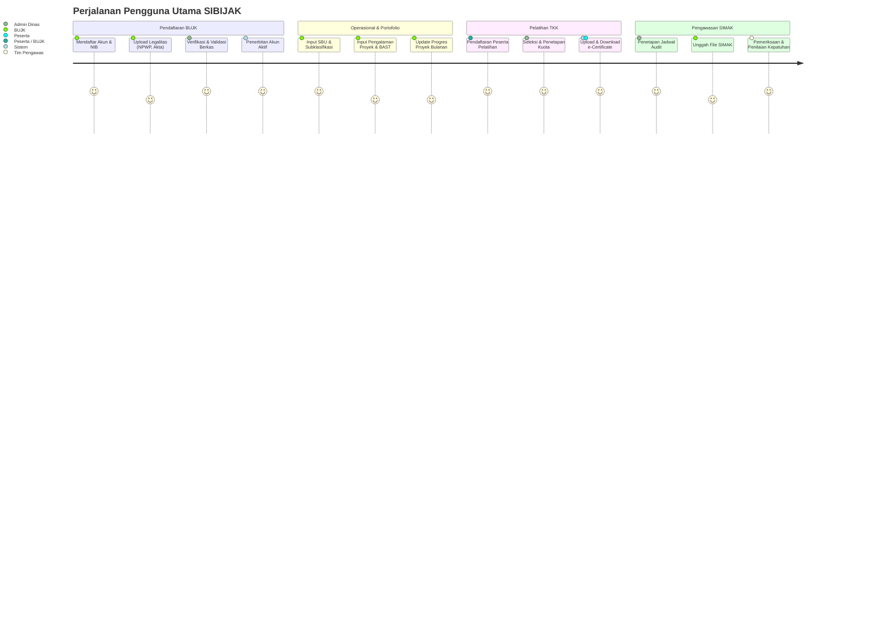
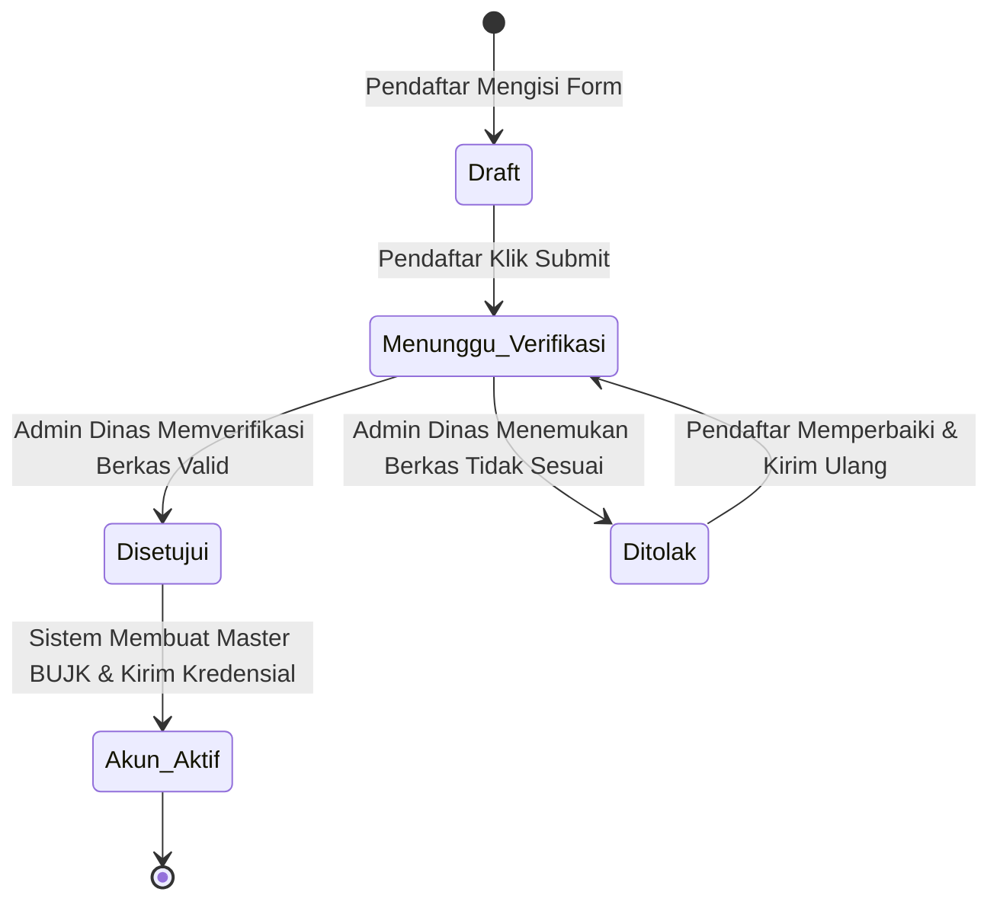
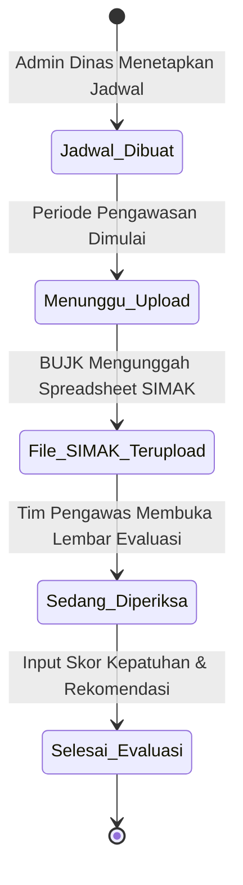

# Product Requirement Document (PRD)
## Sistem Informasi Pembinaan & Pengawasan Jasa Konstruksi (SIBIJAK)

---

## 1. Dokumen Kontrol & Ringkasan Eksekutif

| Atribut | Informasi |
| :--- | :--- |
| **Nama Produk** | Sistem Informasi Pembinaan Jasa Konstruksi (SIBIJAK Platform) |
| **Versi Dokumen** | 1.0.0 |
| **Status** | Final Draft / Ready for Development |
| **Target Pengguna** | Dinas Cipta Karya, Bina Konstruksi dan Tata Ruang (Diciptabintar), Badan Usaha Jasa Konstruksi (BUJK), Tenaga Kerja Konstruksi (TKK), dan Tim Pengawas |
| **Dokumen Referensi** | [SIBIJAK_SYSTEM_SPECIFICATION.md](file:///u:/Project/ciptabintar/SIBIJAK_SYSTEM_SPECIFICATION.md) |

### 1.1 Latar Belakang & Pernyataan Masalah (Problem Statement)
Penyelenggaraan jasa konstruksi di tingkat daerah menuntut pembinaan, standarisasi, dan pengawasan berkala sesuai amanat perundang-undangan (UU Jasa Konstruksi). Saat ini, kendala utama yang dihadapi meliputi:
1. **Fragmentasi Data BUJK & TKK**: Data legalitas, SBU, dan riwayat pengalaman kontraktor sering kali tersebar dan sulit divalidasi secara cepat.
2. **Proses Pengawasan Manual**: Audit kepatuhan standar tertib jasa konstruksi (SIMAK) masih membutuhkan rekap dokumen fisik yang rentan tercecer dan lambat dievaluasi.
3. **Penyelenggaraan Pelatihan & Sertifikasi Belum Terintegrasi**: Pendaftaran, verifikasi kuota, absensi, hingga penerbitan sertifikat keahlian belum terpusat dalam satu alur kerja digital.
4. **Monitoring Proyek Tidak Real-Time**: Pelaporan deviasi progres fisik dan keuangan pekerjaan konstruksi daerah membutuhkan transparansi dan pelaporan berkala yang terstruktur.

### 1.2 Tujuan Produk (Product Objectives) & Nilai Bisnis
* **Sentralisasi Basis Data**: Menjadi *single source of truth* data BUJK, TKK, legalitas, dan riwayat proyek konstruksi di wilayah kota/daerah.
* **Otomasi Alur Verifikasi & Pengawasan**: Mengubah proses pendaftaran dan audit SIMAK menjadi alur digital nir-kertas (*paperless*) dengan pelacakan status transparan.
* **Peningkatan Kualitas SDM Konstruksi**: Memfasilitasi pendaftaran dan penerbitan sertifikat pelatihan kompetensi jasa konstruksi daerah.
* **Kepatuhan Regulasi**: Memastikan setiap badan usaha dan proyek bina konstruksi memenuhi standar tertib usaha, tertib penyelenggaraan, dan tertib pemanfaatan.

### 1.3 Metrik Keberhasilan (Success Metrics / KPIs)
1. **Efisiensi Waktu Verifikasi**: Pengurangan durasi verifikasi berkas pendaftaran BUJK dari rata-rata 7 hari kerja menjadi ≤ 2 hari kerja.
2. **Tingkat Adopsi Pengawasan Digital**: 100% BUJK terdaftar wajib mengunggah instrumen SIMAK secara daring sesuai jadwal periode pengawasan.
3. **Akurasi & Integritas Dokumen**: 0% duplikasi data izin/SBU yang kadaluwarsa melalui automated expiry alert.
4. **Kepuasan Pengguna (CSAT)**: Skor kepuasan pengguna (Dinas & Kontraktor) mencapai minimal 4.5/5.0.

---

## 2. User Personas & User Journey Maps



### Persona 1: Staff Admin / Verifikator Dinas (Internal)
* **Kebutuhan**: Dashboard monitoring, antrian persetujuan verifikasi, manajemen jadwal audit, dan konfigurasi master pelatihan.
* **Pain Points**: Beban verifikasi manual yang menumpuk dan kesulitan melacak riwayat kepatuhan perusahaan dari tahun ke tahun.

### Persona 2: Penanggung Jawab BUJK / Kontraktor (Eksternal)
* **Kebutuhan**: Formulir registrasi yang mudah, notifikasi masa berlaku sertifikat, pengunggahan dokumen SIMAK tanpa harus datang ke kantor dinas, dan pelaporan progres proyek.
* **Pain Points**: Ketidakjelasan status permohonan dan kesulitan memperbarui portofolio pekerjaan.

### Persona 3: Tenaga Kerja Konstruksi / Peserta Pelatihan (Eksternal)
* **Kebutuhan**: Akses jadwal pelatihan bersertifikat, pendaftaran cepat via NIK, dan unduhan e-Certificate resmi.
* **Pain Points**: Kurangnya informasi jadwal pelatihan dan proses penerbitan sertifikat fisik yang memakan waktu lama.

### Persona 4: Tim Asesor / Pengawas Lapangan
* **Kebutuhan**: Akses berkas SIMAK yang diunggah kontraktor dan lembar kerja penilaian kepatuhan standar konstruksi.

---

## 3. Spesifikasi Kebutuhan Fungsional (Functional Requirements)

Prioritas fitur ditentukan menggunakan metode **MoSCoW** (*Must have, Should have, Could have, Won't have*).

```
Must Have (M)  : Wajib ada untuk MVP / Peluncuran Utama.
Should Have (S): Sangat penting, diimplementasikan segera setelah MVP.
Could Have (C) : Fitur peningkatan pengalaman pengguna.
Won't Have (W) : Ditunda ke fase versi berikutnya.
```

### 3.1 Modul 1: Otentikasi, Pengguna & Granular RBAC (Epic-AUTH)

| ID | Kebutuhan Fungsional | Deskripsi & Aturan Bisnis | Prioritas |
| :--- | :--- | :--- | :---: |
| **FR-AUTH-01** | Multi-Role Login | Sistem mendukung login dengan kredensial unik berdasarkan role (Badan Usaha, Admin Dinas, Pengawas, Peserta). | **M** |
| **FR-AUTH-02** | User Management | Admin dapat menambah, mengedit, menonaktifkan akun, dan melihat kontak pengguna. | **M** |
| **FR-AUTH-03** | Secure Password Reset | Mekanisme reset password instan yang terintegrasi verifikasi kontak/WhatsApp atau email. | **M** |
| **FR-AUTH-04** | Granular RBAC Matrix | Sistem menyediakan permission matrix granular dengan **65 aksi teknis** (Data, Tambah, Ubah, Hapus, Detil, Ubah Status, Reset Pass). | **M** |
| **FR-AUTH-05** | Audit Log & Activity Trail | Setiap aksi penambahan, perubahan, persetujuan, dan penghapusan data tercatat dengan ID user, timestamp, dan IP address. | **S** |

---

### 3.2 Modul 2: Pendaftaran & Verifikasi Screening (Epic-REG)

| ID | Kebutuhan Fungsional | Deskripsi & Aturan Bisnis | Prioritas |
| :--- | :--- | :--- | :---: |
| **FR-REG-01** | Pendaftaran BUJK Online | Formulir registrasi publik mandiri untuk BUJK meliputi Nama BU, Bentuk BU, NIB, NPWP, Alamat, Kontak, dan Penanggung Jawab. | **M** |
| **FR-REG-02** | Upload Legalitas Awal | Wajib melampirkan berkas NIB (PDF), NPWP (PDF), dan Akta Perusahaan (PDF) dengan batas ukuran maks. 5MB. | **M** |
| **FR-REG-03** | Workflow Verifikasi Pendaftar | Admin Dinas dapat meninjau berkas dengan 4 status: `Draft`, `Menunggu Verifikasi`, `Disetujui`, `Ditolak`. Penolakan wajib menyertakan alasan/catatan perbaikan. | **M** |
| **FR-REG-04** | Pendaftaran Pelatihan Mandiri | Formulir pendaftaran calon peserta pelatihan menggunakan validasi 16 digit NIK, data instansi asal, kontak WA, dan upload KTP/Ijazah. | **M** |

---

### 3.3 Modul 3: Master Bina Konstruksi & Portofolio (Epic-BIKON)

| ID | Kebutuhan Fungsional | Deskripsi & Aturan Bisnis | Prioritas |
| :--- | :--- | :--- | :---: |
| **FR-BK-01** | Profil Master BUJK | Penyimpanan komprehensif profil BUJK aktif, data PJT (Penanggung Jawab Teknis), dan PJSK (Penanggung Jawab Subklasifikasi). | **M** |
| **FR-BK-02** | Manajemen SBU | Pencatatan detail Sertifikat Badan Usaha: Nomor SBU, Lembaga Penerbit (LSBU/LPJK), Subklasifikasi (KBLI), Kualifikasi (K/M/B), Masa Berlaku, dan Dokumen PDF SBU. | **M** |
| **FR-BK-03** | Expiry Alert SBU | Notifikasi otomatis di dashboard apabila masa berlaku SBU tersisa < 60 hari atau telah kedaluwarsa. | **S** |
| **FR-BK-04** | Portofolio Pengalaman Proyek | Pencatatan rekam jejak pekerjaan yang diselesaikan: Nama Paket, Pemberi Tugas, No/Nilai Kontrak, Tahun Anggaran, serta upload BAST (PHO/FHO). | **M** |
| **FR-BK-05** | Monitoring Progres Pekerjaan | Pelaporan berkala progres fisik (%), keuangan (%), kurva S, deviasi capaian, dan kendala lapangan pada paket pekerjaan aktif. | **M** |

---

### 3.4 Modul 4: Pengawasan Tertib Jasa Konstruksi & SIMAK (Epic-SUPERVISION)

| ID | Kebutuhan Fungsional | Deskripsi & Aturan Bisnis | Prioritas |
| :--- | :--- | :--- | :---: |
| **FR-SUP-01** | Kalender & Penjadwalan Audit | Admin Dinas dapat membuat agenda periode pengawasan (Tahun, Nama Agenda, Tanggal Mulai-Selesai, Lingkup Pengawasan). | **M** |
| **FR-SUP-02** | Upload Instrumen SIMAK | BUJK dapat mengunggah file template spreadsheet SIMAK sesuai periode pengawasan yang dijadwalkan. | **M** |
| **FR-SUP-03** | Pemeriksaan & Lembar Skor | Tim Pengawas dapat mengevaluasi file SIMAK dan menginput status kesesuaian/skor tertib jasa konstruksi. | **M** |
| **FR-SUP-04** | Rekap Kepatuhan Daerah | Ekspor laporan berkala tingkat kepatuhan BUJK terhadap standar tertib usaha dan teknis ke format Excel/PDF. | **S** |

---

### 3.5 Modul 5: Pelatihan, Sertifikasi & Manajemen Peserta (Epic-TRAIN)

| ID | Kebutuhan Fungsional | Deskripsi & Aturan Bisnis | Prioritas |
| :--- | :--- | :--- | :---: |
| **FR-TRN-01** | Manajemen Paket Pelatihan | Pembuatan paket pelatihan mencakup Tahun Anggaran, Sumber Dana, Jenjang KKNI, Kualifikasi, Kuota, Metode (Online/Offline/Hybrid), Jam Pelajaran (JP), dan Lokasi. | **M** |
| **FR-TRN-02** | Live-Search Seleksi Peserta | Admin dapat memasukkan peserta ke dalam paket pelatihan menggunakan pencarian pintar (*Select2 Live Search*) yang terhubung ke database pendaftar. | **M** |
| **FR-TRN-03** | Penetapan Status Kelulusan | Verifikasi kehadiran, penilaian kelulusan, dan pencatatan catatan khusus peserta pelatihan. | **M** |
| **FR-TRN-04** | Penerbitan & Upload e-Certificate | Penomoran resmi sertifikat dan upload file e-Certificate (PDF) yang dapat diunduh langsung oleh peserta. | **M** |
| **FR-TRN-05** | Verifikasi Keaslian Sertifikat | (QR Code) Validasi publik keaslian nomor sertifikat yang diterbitkan oleh sistem. | **S** |

---

### 3.6 Modul 6: Content Management System (CMS) & Layanan Publik (Epic-CMS)

| ID | Kebutuhan Fungsional | Deskripsi & Aturan Bisnis | Prioritas |
| :--- | :--- | :--- | :---: |
| **FR-CMS-01** | Repositori Regulasi Hukum | Katalog publik dokumen hukum/peraturan (UU, Permen, Perda, Perwal) dilengkapi fitur pencarian, filter subjek, dan unduh PDF. | **M** |
| **FR-CMS-02** | Manajemen Warta & Berita | CMS publikasi berita/kegiatan dinas dengan rich text editor (Summernote/TinyMCE), upload cover banner, file lampiran, dan kontrol status (Draft/Publish). | **M** |
| **FR-CMS-03** | Dashboard Statistik Publik | Ringkasan statistik agregat jumlah BUJK, TKK tersertifikasi, dan proyek konstruksi yang dapat dilihat oleh masyarakat umum. | **S** |

---

## 4. Kebutuhan Non-Fungsional (Non-Functional Requirements / NFR)

### 4.1 Kinerja (Performance)
* **Waktu Muat Halaman (Page Load Time)**: Waktu respons halaman rata-rata ≤ 1.5 detik pada koneksi internet standar (10 Mbps).
* **Efisiensi Database**: Kueri tabel dengan ribuan data BUJK/Peserta wajib menggunakan server-side pagination, indexing kunci (NIB, NPWP, NIK), dan caching pada master data referensi.
* **Concurrent Users**: Sistem mampu menangani minimal 500 pengguna aktif bersamaan tanpa penurunan performa signifikan.

### 4.2 Keamanan & Perlindungan Data (Security)
* **Enkripsi Data**: Seluruh transmisi data wajib menggunakan protokol **HTTPS / TLS 1.3**.
* **Keamanan Kredensial**: Password disimpan menggunakan hashing standar industri (**Bcrypt / Argon2id**) dengan salt unik.
* **Sanitasi File & Anti-Malware**: Setiap berkas PDF/Gambar yang diunggah wajib divalidasi MIME-type di sisi server untuk mencegah *arbitrary file execution*.
* **SQL Injection & XSS Protection**: Menggunakan Parameterized Queries / ORM serta sanitasi output HTML pada setiap input teks kaya (*Rich Text*).
* **Perlindungan NIK & Data Pribadi**: NIK dan data kontak hanya dapat diakses oleh user terautentikasi sesuai izin RBAC.

### 4.3 Ketersediaan & Keandalan (Availability & Reliability)
* **SLA Uptime**: Ketersediaan sistem ditargetkan minimal **99.5%** per bulan.
* **Backup Data Otomatis**: Pencadangan database secara terjadwal setiap hari (*daily automated backup*) dan retensi mingguan di penyimpanan terpisah (*off-site cloud storage*).

### 4.4 Aksesibilitas & Responsivitas (UI/UX)
* **Responsif Multi-Device**: Tata letak antarmuka fleksibel dan dapat diakses dengan baik di Desktop (1366x768 ke atas), Tablet, maupun Layar Ponsel.
* **Desain Modern & Konsisten**: Menerapkan sistem desain modern berbasis Tailwind CSS / Shadcn UI dengan hierarki visual yang jelas, feedback interaksi instan (Toast notifications, Loading spinners), dan konfirmasi dialog untuk aksi destruktif (Hapus data).

---

## 5. Alur Kerja Kunci & State Machine

### 5.1 Siklus Verifikasi Pendaftaran BUJK


### 5.2 Siklus Pengawasan Tertib Jasa Konstruksi (SIMAK)


---

## 6. Rencana Rilis & Roadmap Pengembangan (Phased Delivery)

```text
+-----------------------------------------------------------------------------------+
| FASE 1: Core Foundation & Master BUJK (Minggu 1 - 4)                              |
| - Setup Arsitektur, Auth, Granular RBAC (User & Group Management)                 |
| - Registrasi & Verifikasi Pendaftaran BUJK                                        |
| - Master BUJK, SBU, Pengalaman Proyek, dan Dashboard Utama                        |
+-----------------------------------------------------------------------------------+
                                         |
                                         v
+-----------------------------------------------------------------------------------+
| FASE 2: Modul Pelatihan, Peserta & Sertifikat (Minggu 5 - 7)                      |
| - Pendaftaran Pelatihan Publik & Validasi NIK                                     |
| - Manajemen Paket Pelatihan, Seleksi Live-Search, & Penetapan Peserta             |
| - Penerbitan Nomor Sertifikat & Upload e-Certificate (PDF)                        |
+-----------------------------------------------------------------------------------+
                                         |
                                         v
+-----------------------------------------------------------------------------------+
| FASE 3: Modul Pengawasan SIMAK & Monitoring Proyek (Minggu 8 - 10)                |
| - Manajemen Jadwal Pengawasan Periodik                                            |
| - Upload Berkas Instrumen SIMAK per BUJK                                          |
| - Form Evaluasi & Penilaian Kepatuhan Pengawas                                    |
| - Monitoring Realisasi Progres Proyek Konstruksi                                  |
+-----------------------------------------------------------------------------------+
                                         |
                                         v
+-----------------------------------------------------------------------------------+
| FASE 4: CMS Informasi, Pengujian & Peluncuran (Minggu 11 - 12)                    |
| - Modul Regulasi Hukum & Publikasi Berita/Kegiatan                                |
| - Integrasi Notifikasi WhatsApp/Email & Automated Expiry Alert                    |
| - Security Hardening, Penetration Testing & User Acceptance Testing (UAT)         |
+-----------------------------------------------------------------------------------+
```

---

## 7. Matriks Risiko & Rencana Mitigasi

| Risiko Potensial | Tingkat Dampak | Probabilitas | Rencana Mitigasi |
| :--- | :---: | :---: | :--- |
| **Beban Upload Berkas PDF Besar** | Sedang | Tinggi | Terapkan kompresi berkas otomatis di browser/server dan batasi ukuran upload maks 5MB per dokumen. |
| **Kelalaian Memperbarui SBU Kedaluwarsa** | Tinggi | Sedang | Bangun cron job otomatis yang mengirimkan email/notifikasi H-60 dan H-30 sebelum masa berlaku habis. |
| **Penyalahgunaan Akun & Hak Akses** | Sangat Tinggi | Rendah | Terapkan autentikasi ketat, session timeout otomatis, dan pencatatan audit log lengkap untuk setiap aksi admin. |
| **Kegagalan Validasi NIK Peserta** | Sedang | Sedang | Terapkan regex validation 16 digit NIK serta integrasi verifikasi format kependudukan yang ketat. |

---

*Dokumen PRD ini telah diselaraskan dengan seluruh temuan audit sistem SIBIJAK dan siap dieksekusi oleh tim pengembang (Product, Frontend, Backend, dan QA).*
