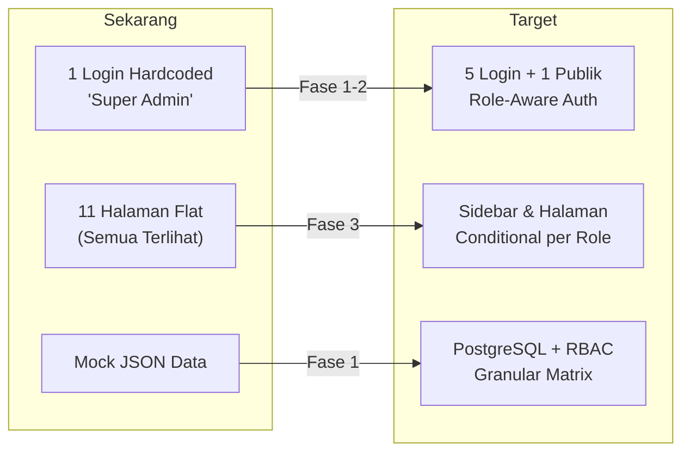
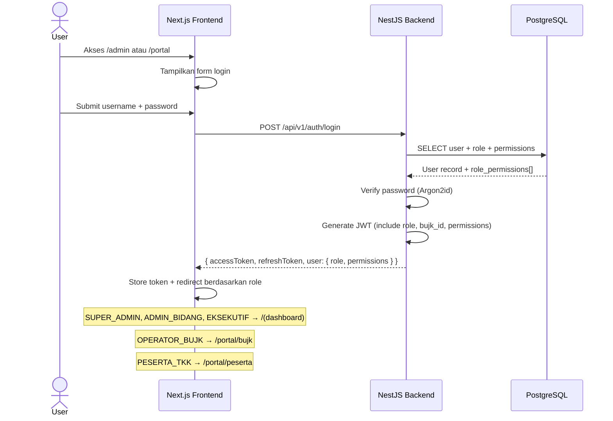
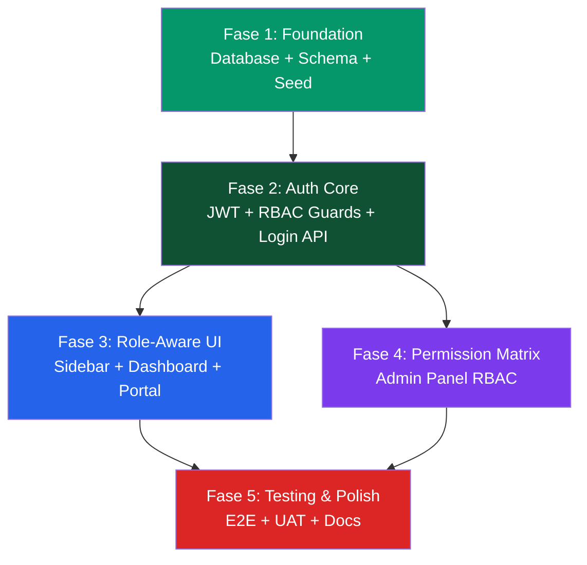

# Implementation Plan — Struktur Role 6 Tier SIJAKON BOGOR

> **Versi:** 1.0.0 | **Tanggal:** 30 September 2026  
> **Referensi:** [PRD v1.1](file:///u:/Project/ciptabintar/PRD_REKOMENDASI_JAKON_BOGOR_2026.md) | [AGENT.md v1.1](file:///u:/Project/ciptabintar/docs/AGENT.md) | [DATABASE_SCHEMA.md](file:///u:/Project/ciptabintar/docs/DATABASE_SCHEMA.md)

---

## 0. Status Saat Ini & Gap Analysis

### Apa yang Sudah Ada (Prototype)

| Komponen | Status | Path |
|:---|:---:|:---|
| Login page (single user, mock auth) | ✅ Prototipe | [`login/page.tsx`](file:///u:/Project/ciptabintar/prototype/src/app/login/page.tsx) |
| Mock auth context (hardcoded "Super Admin") | ✅ Prototipe | [`mock-auth.tsx`](file:///u:/Project/ciptabintar/prototype/src/lib/mock-auth.tsx) |
| Dashboard layout (sidebar + topbar) | ✅ Prototipe | [`(dashboard)/layout.tsx`](file:///u:/Project/ciptabintar/prototype/src/app/(dashboard)/layout.tsx) |
| 11 halaman modul (BUJK, WebGIS, dll.) | ✅ Prototipe | [`(dashboard)/*`](file:///u:/Project/ciptabintar/prototype/src/app/(dashboard)) |
| Mock data JSON (8 file) | ✅ Prototipe | [`data/*.json`](file:///u:/Project/ciptabintar/prototype/src/data) |
| Backend API (NestJS) | ❌ Belum ada | — |
| Database (PostgreSQL + PostGIS) | ❌ Belum ada | — |
| RBAC / Permission system | ❌ Belum ada | — |
| Multi-role login | ❌ Belum ada | — |

### Gap yang Harus Ditutup



---

## 1. Arsitektur Solusi

### 1.1 Alur Autentikasi per Role



### 1.2 JWT Payload Structure

```typescript
interface JwtPayload {
  sub: string;           // user.id
  username: string;
  role: RoleCode;        // 'SUPER_ADMIN' | 'ADMIN_BIDANG' | 'EKSEKUTIF' | 'OPERATOR_BUJK' | 'PESERTA_TKK'
  bujkId: string | null; // Non-null hanya untuk OPERATOR_BUJK
  permissions: string[]; // ['bujk:create', 'bujk:read', 'supervision:assess', ...]
  iat: number;
  exp: number;
}
```

---

## 2. Fase Implementasi

### Dependency Graph



---

### Fase 1: Foundation — Database, Schema & Seed 🟢

> **Tujuan:** Menyiapkan infrastruktur database dan tabel RBAC sebagai fondasi seluruh fitur.

#### Task 1.1: Setup Database & Prisma Schema

| Atribut | Detail |
|:---|:---|
| **Estimasi** | 4-6 jam |
| **Prasyarat** | Docker Compose (PostgreSQL + PostGIS + Redis) |
| **Output** | Prisma schema + migration + seed script |

**Langkah:**

1. **Inisialisasi Prisma ORM** di backend:
   ```bash
   npx prisma init --datasource-provider postgresql
   ```

2. **Definisikan model** di `schema.prisma`:
   ```prisma
   model Role {
     id          String   @id @default(cuid())
     code        String   @unique @db.VarChar(30)
     name        String   @db.VarChar(100)
     description String?  @db.VarChar(255)
     isSystem    Boolean  @default(false) @map("is_system")
     createdAt   DateTime @default(now()) @map("created_at")
     updatedAt   DateTime @updatedAt @map("updated_at")

     users       User[]
     permissions RolePermission[]

     @@map("roles")
   }

   model RolePermission {
     id        String  @id @default(cuid())
     roleId    String  @map("role_id")
     resource  String  @db.VarChar(50)  // 'BUJK', 'SUPERVISION', 'TRAINING', etc.
     action    String  @db.VarChar(30)  // 'CREATE', 'READ', 'UPDATE', 'DELETE', 'VERIFY', etc.
     isGranted Boolean @default(true) @map("is_granted")

     role      Role    @relation(fields: [roleId], references: [id], onDelete: Cascade)

     @@unique([roleId, resource, action])
     @@map("role_permissions")
   }

   model User {
     id           String    @id @default(cuid())
     roleId       String    @map("role_id")
     bujkId       String?   @map("bujk_id")
     username     String    @unique @db.VarChar(50)
     email        String    @unique @db.VarChar(100)
     passwordHash String    @map("password_hash") @db.VarChar(255)
     fullName     String    @map("full_name") @db.VarChar(150)
     phoneNumber  String?   @map("phone_number") @db.VarChar(20)
     photoUrl     String?   @map("photo_url") @db.VarChar(255)
     isActive     Boolean   @default(true) @map("is_active")
     lastLoginAt  DateTime? @map("last_login_at")
     createdAt    DateTime  @default(now()) @map("created_at")
     updatedAt    DateTime  @updatedAt @map("updated_at")

     role         Role      @relation(fields: [roleId], references: [id], onDelete: Restrict)
     auditLogs    AuditLog[]

     @@map("users")
   }
   ```

3. **Jalankan migrasi awal:**
   ```bash
   npx prisma migrate dev --name init_rbac_schema
   ```

#### Task 1.2: Seed Data — 5 Role + Demo Users + Permissions

| Atribut | Detail |
|:---|:---|
| **Estimasi** | 2-3 jam |
| **Output** | `prisma/seed.ts` yang bisa dijalankan ulang (idempotent) |

**Seed data yang harus dibuat:**

```text
ROLES (5):
├── SUPER_ADMIN    → 65 permissions (semua is_granted = true)
├── ADMIN_BIDANG   → ~40 permissions (configurable per varian)
├── EKSEKUTIF      → ~12 permissions (semua READ/EXPORT only)
├── OPERATOR_BUJK  → ~15 permissions (BUJK-scoped)
└── PESERTA_TKK    → ~5 permissions (pelatihan + sertifikat)

DEMO USERS (6 — satu per role):
├── superadmin     / Super Admin             / SUPER_ADMIN
├── op_binkon      / Operator Bina Konstruksi / ADMIN_BIDANG (varian Bina Konstruksi)
├── op_pengawas    / Tim Pengawas Lapangan    / ADMIN_BIDANG (varian Pengawas)
├── eksekutif      / Kepala Dinas DPU         / EKSEKUTIF
├── bujk_demo      / PT Maju Bersama         / OPERATOR_BUJK (bujk_id linked)
└── peserta_demo   / Ahmad Fauzi             / PESERTA_TKK
```

**Permission Matrix Seed (Resource × Action):**

| Resource | CREATE | READ | UPDATE | DELETE | VERIFY | EXPORT | AUDIT |
|:---|:---:|:---:|:---:|:---:|:---:|:---:|:---:|
| `DASHBOARD` | — | ✅ | — | — | — | — | — |
| `BUJK` | ✅ | ✅ | ✅ | ✅ | ✅ | ✅ | — |
| `SBU` | ✅ | ✅ | ✅ | ✅ | — | ✅ | — |
| `PROJECT` | ✅ | ✅ | ✅ | ✅ | — | ✅ | — |
| `SUPERVISION` | ✅ | ✅ | ✅ | ✅ | — | ✅ | ✅ |
| `TRAINING` | ✅ | ✅ | ✅ | ✅ | — | ✅ | — |
| `PARTICIPANT` | ✅ | ✅ | ✅ | ✅ | ✅ | ✅ | — |
| `CERTIFICATE` | ✅ | ✅ | ✅ | ✅ | — | ✅ | — |
| `REGULATION` | ✅ | ✅ | ✅ | ✅ | — | — | — |
| `NEWS` | ✅ | ✅ | ✅ | ✅ | — | — | — |
| `USER` | ✅ | ✅ | ✅ | ✅ | — | — | ✅ |
| `ROLE` | ✅ | ✅ | ✅ | ✅ | — | — | — |
| `AUDIT_LOG` | — | ✅ | — | — | — | ✅ | — |
| `GIS` | ✅ | ✅ | ✅ | ✅ | — | ✅ | — |
| `REPORT` | ✅ | ✅ | — | — | — | ✅ | — |

> Total: **15 resources × 7 actions = 105 possible permissions** → Super Admin mendapat semua, role lain mendapat subset.

---

### Fase 2: Auth Core — JWT, Guards & Login API 🟢

> **Tujuan:** Membangun sistem autentikasi production-ready dengan RBAC enforcement.

#### Task 2.1: Auth Module (NestJS Backend)

| Atribut | Detail |
|:---|:---|
| **Estimasi** | 6-8 jam |
| **File utama** | `modules/auth/auth.service.ts`, `auth.controller.ts` |
| **Dependencies** | `@nestjs/jwt`, `@nestjs/passport`, `argon2` |

**Endpoint yang dibangun:**

```text
POST   /api/v1/auth/login          → Login (return JWT + user + permissions)
POST   /api/v1/auth/refresh         → Refresh token rotation
POST   /api/v1/auth/logout          → Invalidate refresh token
GET    /api/v1/auth/me              → Get current user profile + permissions
PATCH  /api/v1/auth/change-password → Ganti password sendiri
```

**Login response structure:**
```json
{
  "accessToken": "eyJ...",
  "refreshToken": "dGhp...",
  "expiresIn": 3600,
  "user": {
    "id": "usr_xxx",
    "username": "op_pengawas",
    "fullName": "Ir. Siti Aminah, MT",
    "role": {
      "code": "ADMIN_BIDANG",
      "name": "Admin Bidang"
    },
    "bujkId": null,
    "permissions": [
      "supervision:create", "supervision:read", "supervision:update",
      "bujk:read", "project:read"
    ]
  }
}
```

#### Task 2.2: RBAC Guards & Decorators

| Atribut | Detail |
|:---|:---|
| **Estimasi** | 4-5 jam |
| **File utama** | `common/guards/`, `common/decorators/` |

**Komponen yang dibangun:**

```text
common/
├── guards/
│   ├── jwt-auth.guard.ts          → Validasi JWT token
│   ├── roles.guard.ts             → Cek role code (level 1)
│   ├── permissions.guard.ts       → Cek resource:action (level 2, granular)
│   └── tenant.guard.ts            → Cek bujk_id ownership (OPERATOR_BUJK)
├── decorators/
│   ├── roles.decorator.ts         → @Roles('SUPER_ADMIN', 'ADMIN_BIDANG')
│   ├── permissions.decorator.ts   → @RequirePermission('bujk', 'create')
│   ├── current-user.decorator.ts  → @CurrentUser() user: AuthUser
│   └── audit-log.decorator.ts     → @AuditLog({ module, action })
├── pipes/
│   └── zod-validation.pipe.ts     → ZodValidationPipe
└── types/
    └── auth.types.ts              → AuthUser, JwtPayload interfaces
```

**Contoh penggunaan berlapis:**

```typescript
// Level 1: Cek role
@Roles('SUPER_ADMIN', 'ADMIN_BIDANG')

// Level 2: Cek permission granular (untuk Admin Bidang dengan varian berbeda)
@RequirePermission('supervision', 'create')

// Level 3: Cek tenant ownership (untuk OPERATOR_BUJK)
@UseGuards(TenantGuard)
```

#### Task 2.3: Multi-Portal Login UI (Frontend)

| Atribut | Detail |
|:---|:---|
| **Estimasi** | 4-5 jam |
| **File utama** | `app/(auth)/login/page.tsx`, `app/portal/login/page.tsx` |

**Apa yang dibangun:**

1. **Refactor** [`mock-auth.tsx`](file:///u:/Project/ciptabintar/prototype/src/lib/mock-auth.tsx) → `lib/auth-provider.tsx` (real JWT-based)

2. **Dua entry point login:**

   ```text
   /login           → Login internal (Super Admin, Admin Bidang, Eksekutif)
                       Design: tema formal DPU dengan badge "Portal Dinas"

   /portal/login    → Login eksternal (Operator BUJK, Peserta TKK)
                       Design: tema yang lebih friendly dengan badge "Portal Mitra"
                       + Link ke form pendaftaran BUJK / Pelatihan
   ```

3. **Post-login redirect logic:**
   ```typescript
   function getRedirectPath(role: RoleCode): string {
     switch (role) {
       case 'SUPER_ADMIN':
       case 'ADMIN_BIDANG':
       case 'EKSEKUTIF':
         return '/dashboard';
       case 'OPERATOR_BUJK':
         return '/portal/bujk';
       case 'PESERTA_TKK':
         return '/portal/peserta';
     }
   }
   ```

4. **Demo role switcher** (development only) — dropdown di login page untuk memilih demo user per role.

---

### Fase 3: Role-Aware UI — Sidebar, Dashboard & Portal 🔵

> **Tujuan:** Tampilan dan navigasi menyesuaikan berdasarkan role yang login.

#### Task 3.1: Conditional Sidebar & Topbar

| Atribut | Detail |
|:---|:---|
| **Estimasi** | 4-5 jam |
| **File utama** | [`sidebar.tsx`](file:///u:/Project/ciptabintar/prototype/src/components/layout/sidebar.tsx), [`topbar.tsx`](file:///u:/Project/ciptabintar/prototype/src/components/layout/topbar.tsx) |

**Menu visibility per role:**

```typescript
const menuConfig: MenuItem[] = [
  {
    label: 'Dashboard',
    icon: LayoutDashboard,
    href: '/dashboard',
    roles: ['SUPER_ADMIN', 'ADMIN_BIDANG', 'EKSEKUTIF'],
  },
  {
    label: 'Pendaftaran',
    icon: UserPlus,
    roles: ['SUPER_ADMIN', 'ADMIN_BIDANG'],
    children: [
      { label: 'Badan Usaha', href: '/bujk/pendaftaran', permission: 'bujk:verify' },
      { label: 'Pelatihan', href: '/pelatihan/pendaftaran', permission: 'participant:verify' },
    ],
  },
  {
    label: 'Bina Konstruksi',
    icon: Building2,
    roles: ['SUPER_ADMIN', 'ADMIN_BIDANG', 'EKSEKUTIF'],
    children: [
      { label: 'Master BUJK', href: '/bujk' },
      { label: 'SBU', href: '/bujk/sbu' },
      { label: 'Pengalaman', href: '/bujk/pengalaman' },
      { label: 'Progres Proyek', href: '/bujk/proyek' },
    ],
  },
  {
    label: 'WebGIS',
    icon: Map,
    href: '/webgis',
    roles: ['SUPER_ADMIN', 'ADMIN_BIDANG', 'EKSEKUTIF'],
  },
  {
    label: 'Pengawasan',
    icon: ClipboardCheck,
    roles: ['SUPER_ADMIN', 'ADMIN_BIDANG'],
    permission: 'supervision:read',  // Hanya Admin Bidang varian Pengawas
    children: [...],
  },
  {
    label: 'Pelatihan',
    icon: GraduationCap,
    roles: ['SUPER_ADMIN', 'ADMIN_BIDANG'],
    permission: 'training:read',
    children: [...],
  },
  {
    label: 'Pelaporan',
    icon: FileBarChart,
    href: '/pelaporan',
    roles: ['SUPER_ADMIN', 'ADMIN_BIDANG', 'EKSEKUTIF'],
  },
  {
    label: 'Pengaturan',
    icon: Settings,
    roles: ['SUPER_ADMIN'],  // HANYA Super Admin
    children: [
      { label: 'Pengguna', href: '/pengaturan/pengguna' },
      { label: 'Role & Permission', href: '/pengaturan/role' },
      { label: 'Audit Trail', href: '/pengaturan/audit-log' },
    ],
  },
];
```

**Topbar updates:**
- Tampilkan nama role + badge warna sesuai role
- Profile dropdown menunjukkan role dan portal yang aktif

#### Task 3.2: Dashboard Variants per Role

| Atribut | Detail |
|:---|:---|
| **Estimasi** | 5-6 jam |
| **File utama** | `app/(dashboard)/dashboard/page.tsx` |

**3 varian dashboard:**

| Role | Tampilan Dashboard |
|:---|:---|
| **Super Admin / Admin Bidang** | Dashboard penuh: 4 KPI cards + peta mini + grafik distribusi + notifikasi SBU expiry + agenda pengawasan |
| **Eksekutif** | Executive dashboard: KPI cards ringkas + trend chart (YoY) + quick download laporan PDF/Excel |
| **Operator BUJK** | Portal BUJK: profil perusahaan + status SBU + progres proyek sendiri + notifikasi |
| **Peserta TKK** | Portal peserta: jadwal pelatihan + status seleksi + download sertifikat |

#### Task 3.3: Portal Eksternal (BUJK & Peserta)

| Atribut | Detail |
|:---|:---|
| **Estimasi** | 6-8 jam |
| **File utama** | `app/portal/bujk/`, `app/portal/peserta/` |

**Route structure baru:**

```text
app/
├── (auth)/
│   ├── login/page.tsx              ← Login internal (dinas)
│   └── register/                   ← Self-registration
│       ├── bujk/page.tsx           ← Pendaftaran BUJK (stepper wizard)
│       └── pelatihan/page.tsx      ← Pendaftaran peserta pelatihan
├── (dashboard)/                    ← Area internal (Super Admin, Admin Bidang, Eksekutif)
│   ├── layout.tsx                  ← Sidebar + Topbar layout
│   └── ...existing pages...
├── portal/
│   ├── login/page.tsx              ← Login eksternal (BUJK & TKK)
│   ├── bujk/                       ← Portal BUJK (OPERATOR_BUJK)
│   │   ├── layout.tsx              ← Portal layout (sidebar simplified)
│   │   ├── page.tsx                ← Dashboard perusahaan
│   │   ├── sbu/page.tsx            ← Kelola SBU
│   │   ├── proyek/page.tsx         ← Progres proyek
│   │   └── simak/page.tsx          ← Upload SIMAK
│   └── peserta/                    ← Portal peserta (PESERTA_TKK)
│       ├── layout.tsx              ← Portal layout (minimal)
│       ├── page.tsx                ← Dashboard peserta
│       ├── pelatihan/page.tsx      ← Jadwal & status pelatihan
│       └── sertifikat/page.tsx     ← Download sertifikat
└── (public)/                       ← Halaman publik (tanpa login)
    ├── page.tsx                    ← Landing page + peta publik
    ├── regulasi/page.tsx
    ├── berita/page.tsx
    └── validasi/[token]/page.tsx   ← Validasi QR sertifikat
```

---

### Fase 4: Permission Matrix — Admin Panel RBAC 🟣

> **Tujuan:** Super Admin dapat mengkonfigurasi permission setiap role dari UI.

#### Task 4.1: API CRUD Role & Permission

| Atribut | Detail |
|:---|:---|
| **Estimasi** | 4-5 jam |
| **Endpoint** | `/api/v1/roles`, `/api/v1/roles/:id/permissions` |

```text
GET    /api/v1/roles                         → List semua role
POST   /api/v1/roles                         → Buat role baru (non-system)
PATCH  /api/v1/roles/:id                     → Edit nama/deskripsi role
DELETE /api/v1/roles/:id                     → Hapus role (hanya non-system)
GET    /api/v1/roles/:id/permissions         → Get permission matrix role tertentu
PUT    /api/v1/roles/:id/permissions         → Bulk update permission matrix
```

#### Task 4.2: Halaman Admin — Manajemen Role & Permission

| Atribut | Detail |
|:---|:---|
| **Estimasi** | 6-8 jam |
| **Path** | `/pengaturan/role`, `/pengaturan/role/[id]/permission` |

**UI Features:**
- Tabel daftar role dengan badge `System` / `Custom`
- Tombol "Buat Role Baru" (clone dari role existing)
- Halaman permission matrix: grid toggle (checkmark hijau / silang merah) per resource × action
- Preset varian: tombol "Terapkan Preset Pengawas", "Terapkan Preset Pelatihan", dll.

#### Task 4.3: Halaman Admin — Manajemen User

| Atribut | Detail |
|:---|:---|
| **Estimasi** | 4-5 jam |
| **Path** | `/pengaturan/pengguna` |

**Perubahan dari halaman existing di [`pengaturan/page.tsx`](file:///u:/Project/ciptabintar/prototype/src/app/(dashboard)/pengaturan/page.tsx):**
- Tambah dropdown "Role" pada form create/edit user
- Conditional field `bujk_id` (muncul hanya jika role = OPERATOR_BUJK)
- Tambah kolom "Role" di tabel user dengan badge warna
- Tombol "Reset Password" → kirim via WhatsApp/Email

---

### Fase 5: Testing & Polish 🔴

> **Tujuan:** Validasi end-to-end dan kesiapan UAT.

#### Task 5.1: Unit & Integration Tests

| Atribut | Detail |
|:---|:---|
| **Estimasi** | 4-5 jam |
| **Tools** | Vitest (unit), Supertest (API integration) |

**Test cases kritis:**

```text
Auth Service:
  ✓ Login sukses dengan credentials valid → return JWT + role
  ✓ Login gagal dengan password salah → return 401
  ✓ Account lockout setelah 5 percobaan gagal
  ✓ Token refresh rotation → old token invalidated

RBAC Guard:
  ✓ SUPER_ADMIN dapat akses semua endpoint
  ✓ ADMIN_BIDANG tanpa permission 'supervision:create' → 403 Forbidden
  ✓ ADMIN_BIDANG dengan permission 'supervision:create' → 200 OK
  ✓ EKSEKUTIF tidak bisa POST/PUT/DELETE → 403 Forbidden
  ✓ OPERATOR_BUJK hanya lihat data bujk_id sendiri
  ✓ PESERTA_TKK tidak bisa akses modul pengawasan

Tenant Guard:
  ✓ OPERATOR_BUJK akses data perusahaan sendiri → 200
  ✓ OPERATOR_BUJK akses data perusahaan lain → 403
```

#### Task 5.2: E2E Tests (Playwright)

| Atribut | Detail |
|:---|:---|
| **Estimasi** | 3-4 jam |
| **Tools** | Playwright |

**Scenario per role:**

```text
Scenario 1: Super Admin Login Flow
  → Login /login → redirect /dashboard → sidebar 8 menu → buka /pengaturan/role → OK

Scenario 2: Admin Bidang (Pengawas) Login Flow
  → Login /login → redirect /dashboard → sidebar hanya menu yang diizinkan
  → Akses /pengawasan → OK
  → Akses /pengaturan → redirect /403 atau hidden

Scenario 3: Eksekutif Login Flow
  → Login /login → redirect /dashboard (executive version)
  → Semua tombol "Tambah/Edit/Hapus" hidden
  → Download laporan PDF → OK

Scenario 4: Operator BUJK Login Flow
  → Login /portal/login → redirect /portal/bujk
  → Hanya lihat data PT sendiri
  → Upload SIMAK → OK

Scenario 5: Peserta TKK Login Flow
  → Login /portal/login → redirect /portal/peserta
  → Lihat jadwal pelatihan → Download sertifikat → OK
```

#### Task 5.3: Seed Script & Demo Environment

| Atribut | Detail |
|:---|:---|
| **Estimasi** | 2-3 jam |

- Script `prisma/seed.ts` yang idempotent (bisa dijalankan berkali-kali)
- 6 demo user (satu per role) dengan password standar `Demo2026!`
- Data mock BUJK, SBU, proyek, pelatihan yang terkait dengan demo user
- README instruksi setup lokal + login credentials per role

---

## 3. Ringkasan Estimasi & Timeline

| Fase | Tasks | Estimasi | Prioritas |
|:---|:---|:---:|:---:|
| **Fase 1** — Foundation | 1.1, 1.2 | **6-9 jam** | 🔴 Kritis |
| **Fase 2** — Auth Core | 2.1, 2.2, 2.3 | **14-18 jam** | 🔴 Kritis |
| **Fase 3** — Role-Aware UI | 3.1, 3.2, 3.3 | **15-19 jam** | 🟠 Tinggi |
| **Fase 4** — Permission Matrix | 4.1, 4.2, 4.3 | **14-18 jam** | 🟡 Sedang |
| **Fase 5** — Testing & Polish | 5.1, 5.2, 5.3 | **9-12 jam** | 🟠 Tinggi |
| | | **Total: 58-76 jam** | |

```text
Timeline Rekomendasi (1 developer full-time):

Minggu 1:  ████████████████████████  Fase 1 + Fase 2
Minggu 2:  ████████████████████████  Fase 3 + Fase 4 (paralel)
Minggu 3:  ████████████████         Fase 5 + Buffer
```

---

## 4. Risiko & Mitigasi

| # | Risiko | Dampak | Mitigasi |
|:-:|:---|:---:|:---|
| 1 | Backend NestJS belum ada — Fase 1-2 butuh setup dari nol | Tinggi | Gunakan `nest new` CLI + Prisma boilerplate. Bisa setup dalam 2-3 jam. |
| 2 | Prototype frontend menggunakan mock data JSON, bukan API call | Sedang | Fase 3 sekaligus refactor data fetching ke API client. Gunakan React Query / SWR. |
| 3 | Sidebar existing di prototype tidak mendukung role-based rendering | Sedang | Refactor sidebar ke config-driven (Task 3.1). Backward-compatible. |
| 4 | Permission matrix UI kompleks (15 resources × 7 actions) | Sedang | Gunakan preset template (Pengawas, Pelatihan, CMS) + toggle individual. |
| 5 | Session timeout berbeda per role (30-120 menit) | Rendah | Set `expiresIn` JWT berdasarkan role di auth service. |

---

## 5. Kriteria Keberhasilan (Definition of Done)

- [ ] 6 demo user bisa login (1 per role) dan di-redirect ke dashboard yang sesuai
- [ ] Sidebar hanya menampilkan menu sesuai permission role yang login
- [ ] Super Admin bisa membuat/mengkonfigurasi role baru dari halaman `/pengaturan/role`
- [ ] OPERATOR_BUJK hanya bisa melihat data perusahaan sendiri (tenant isolation verified)
- [ ] EKSEKUTIF tidak bisa menambah/mengubah/menghapus data apapun
- [ ] ADMIN_BIDANG (varian Pengawas) bisa mengisi checklist audit tapi tidak bisa kelola user
- [ ] Audit trail mencatat semua aksi login dan mutasi data dengan user_id dan role
- [ ] Semua test cases pada Fase 5 passed ✅
- [ ] README terupdate dengan instruksi setup + credentials demo per role
